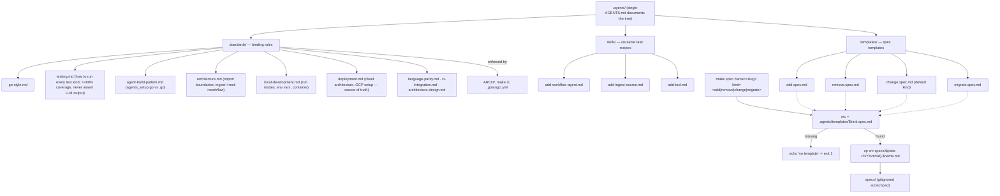

# .agents

The open-standard knowledge directory — the rules and reusable recipes that keep
this repo architecturally sound. This single `AGENTS.md` documents the whole
`.agents/` tree; the subdirectories below do not carry their own.

## Flow



## `standards/` — binding rules

The rules of the codebase. Enforced where possible by `ARCH/`, `make ci`, and
`.golangci.yml`; otherwise treat them as required review criteria.

- `go-style.md` — formatting, naming, error handling, package design.
- `testing.md` — how to run every kind of test per port (Go current); the ≥80% coverage
  and "never assert LLM output" rules.
- `local-development.md` — prerequisites, run modes, env-var reference, local container.
- `deployment.md` — **source of truth** for cloud architecture + GCP setup (root
  `DEPLOYMENT.md` is a thin status/checklist pointer back here).
- `ci-integration.md` — how a CI workflow drives the lint/coverage fixers.
- `agent-build-pattern.md` — the `agents_setup.go` (wiring) vs `<name>.go` (logic) split.
- `architecture.md` — import boundaries and the ingest→root→workflow flow.
- `architecture-design.md` — the authoritative language-neutral design.
- `language-parity.md` — the 1:1 cross-port contract (Go is the reference).

The how-to-run docs document the design and how each port runs/tests/deploys; the ports
are kept at 1:1 parity per `language-parity.md` (Go is the reference).

When standards and convenience conflict, the standards win.

## `skills/` — reusable task recipes

Step-by-step recipes for common tasks, so work is consistent regardless of who or
what performs it. Populated as the codebase grows. Planned:

- `add-workflow-agent.md` — scaffold a new agent dir using the build-agent pattern.
- `add-ingest-source.md` — wire a new `ingest.Kind` and its handler.
- `add-tool.md` — add a deterministic tooling package and its tests.

## `templates/` — spec templates

Copy one into `specs/` to plan a change before writing code:

```bash
make spec name=<slug> kind=<add|remove|change|migrate>
```

- `add.spec.md` — introduce new functionality.
- `remove.spec.md` — delete functionality safely.
- `change.spec.md` — modify existing behavior.
- `migrate.spec.md` — move/restructure (data, layout, dependency, provider).

`specs/` is gitignored developer memory — scratchpads for working through a change,
not committed artifacts. These templates are the committed, shared starting points.
