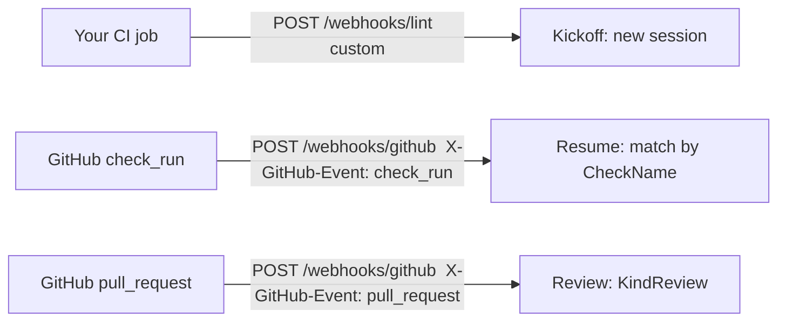

# Webhooks & CI check names

The canonical registry of the agent's **webhook routes** and the **GitHub `check_run`
names** each workflow uses. When you add, remove, or rename a kickoff route or a verify
check, update the tables here in the same change — they are the human-readable source of
truth that the code must agree with. For the CI-author how-to (workflow YAML, signing,
per-stack examples) see [`ci-integration.md`](ci-integration.md); for the why, see
[`architecture-design.md`](architecture-design.md) §8.

## Entry doors

Work arrives through three door patterns:

- **Custom-route kickoff — a webhook you control.** A CI job `POST`s a trusted envelope
  (`{repo, base, report}`) to a **per-workflow** route (lint, coverage). You choose the URL
  and the payload shape. HMAC-authenticated with `GITHUB_WEBHOOK_SECRET` when one is set.
- **Native `check_run` resume.** When a fixer's verify check completes on the PR it opened,
  GitHub delivers a `check_run` event. A GitHub App has a **single webhook URL**, so *every*
  workflow's resume lands on the one `/webhooks/github` route. The agent fans the event to
  each engine; an engine no-ops unless the incoming check name equals its own `CheckName`.
- **Native-event kickoff (the reviewer).** The PR code-review agent's kickoff is itself a
  **native GitHub event** (`pull_request`), not a custom route — the App delivers it to the
  same `/webhooks/github` URL. The handler routes by the `X-GitHub-Event` header:
  `pull_request` → `KindReview` (kick off a review), `check_run` → `KindCI` (resume a fixer).
  Any other event is acknowledged (200) and ignored. So one URL carries both a kickoff and a
  resume, told apart by the event header.

So kickoff routing is **per-workflow** — by URL for the fixers, by `X-GitHub-Event` for the
reviewer; `check_run` resume routing is **shared** (one URL, matched by check name).

## Kickoff routes

| Workflow | Kickoff route | ingest `Kind` | Branch | Label |
|---|---|---|---|---|
| Lint | `POST /webhooks/lint` | `KindLint` | `automation-agent/lint-fix` | `automation-agent` |
| Coverage | `POST /webhooks/coverage` | `KindCoverage` | `automation-agent/test-coverage` | `automation-agent` |

## Native-event routes (on `/webhooks/github`)

These arrive on the single App webhook URL and are routed by the `X-GitHub-Event` header.

| Workflow | `X-GitHub-Event` | ingest `Kind` | Notes |
|---|---|---|---|
| Reviewer | `pull_request` | `KindReview` | Native-event kickoff. Comment-only; opens no PR/branch. |
| Fixer resume | `check_run` | `KindCI` | Resume routing matches by `CheckName` (see below). |

The reviewer publishes its own advisory **`agent-review`** check — see *Agent-published
checks* below.

## Resume check names (`check_run`)

These are the checks the agent **reads** (on a `check_run` event) to resume a parked fixer run.

| Workflow | Verify check name | Branch gate (`head.ref ==`) | Resume route |
|---|---|---|---|
| Lint | `agent-lint-verify` | `automation-agent/lint-fix` | `POST /webhooks/github` |
| Coverage | `agent-coverage-verify` | `automation-agent/test-coverage` | `POST /webhooks/github` |

## Agent-published checks

Distinct from the verify checks above: the reviewer **publishes** a check that humans (not
the agent) consume. It is advisory — its conclusion is `success` (green) or `neutral`
(yellow/red, and the too-large *deny* path); it is **never `failure`**, so it never gates a
merge.

| Workflow | Published check name | Conclusion | Consumed by |
|---|---|---|---|
| Reviewer | `agent-review` | `success` \| `neutral` (never `failure`) | humans (advisory) |

`agent-review` is set as the `checkName` constant in
`go/internal/agent/reviewer/publish.go`. Like the verify-check names it is an **external
contract** — globally unique and identical across all four ports.

## The rules (the contract)

- **Check names must be globally unique across all workflows.** The agent routes a
  `check_run` purely by name (`ev.CheckName == spec.CheckName`); two workflows sharing a
  name would cross-fire each other's resumes (a lint check could resume a coverage session).
  Uniqueness is what keeps each task isolated.
- **The agent writes *and* reads the same name.** It creates the verify check on its PR using
  `spec.CheckName`, then later filters resume events on that same constant — so the match is
  guaranteed by construction, not coincidence.
- **Naming patterns.** Verify check: `agent-<workflow>-verify`. Branch: `automation-agent/<slug>`.
  Keep new workflows to these patterns.
- **The label does not distinguish workflows.** Every agent PR shares the single
  `automation-agent` label (used for discovery). The CI *workflow gate* tells workflows apart
  by **branch** (`head.ref`); the agent's *resume routing* tells them apart by **check name**.
  Never rely on the label to route or isolate.

## Where these values live (source of truth)

Each route, `Kind`, branch, and check name is set in the engine `Spec` at construction. Go is
the reference:

- Lint — `go/internal/agent/lintfixer/lint.go` (`CheckName: "agent-lint-verify"`, branch `automation-agent/lint-fix`)
- Coverage — `go/internal/agent/covfixer/coverage.go` (`CheckName: "agent-coverage-verify"`, branch `automation-agent/test-coverage`)
- Reviewer — `go/internal/agent/reviewer/publish.go` (`checkName: "agent-review"`); a native-event kickoff on `pull_request` (no kickoff route, no branch, opens no PR)

These strings are an **external contract** and must be **identical across all four ports**
(`go/`, `python/`, `kotlin/`, `javascript/`) — see [`language-parity.md`](language-parity.md)
§"External contracts". This doc is the registry; the code is the runtime source; they must
agree. When you change one, change all of them and this table in the same change.

## Adding a new workflow

When you add a fixer (e.g. a `format` or `typecheck` fixer):

1. Choose a **unique** kickoff route, ingest `Kind`, branch (`automation-agent/<slug>`), and
   verify check name (`agent-<name>-verify`). Reuse the shared `automation-agent` label.
2. Register its engine and wire the kickoff route + resume dispatch — in **every** port.
3. Add a row to **both** tables above.
4. Add a CI-author example to [`ci-integration.md`](ci-integration.md).
5. Confirm the new check name collides with no existing one (see the rules above).

## Tracing

When tracing is enabled, an inbound `/webhooks/*` request is the **server-span / trace root**, and
`/internal/dispatch` (the Cloud Tasks worker) continues that trace from the task's `traceparent`
header — so a webhook and the workflow it triggers share one trace. `/healthz` is excluded. This is
transparent to the routing contract above; see [`observability.md`](observability.md).

## See also

- [`ci-integration.md`](ci-integration.md) — CI-author how-to: workflow YAML, kickoff signing, per-stack examples, the resume verify-check workflows.
- [`architecture-design.md`](architecture-design.md) §8 — why a dedicated, branch-gated agent check exists and how the suspend/resume loop works.
- [`observability.md`](observability.md) — how the ingress span roots the trace and the flush-before-return constraint.
- [`language-parity.md`](language-parity.md) — routes and check names as a cross-port external contract.
