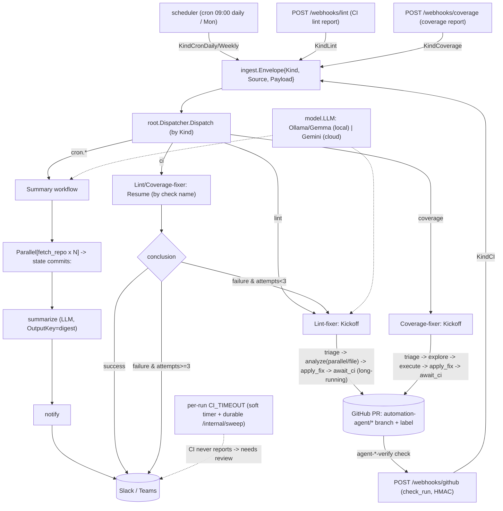

# automation-agent

This repository is an automation service built on the Agent Development Kit (ADK).
The **Go** implementation in [`go/`](go/) is the canonical reference; sibling ports
live in their own top-level folders. Read [`.agents/standards/architecture-design.md`](.agents/standards/architecture-design.md)
first — it is the authoritative, language-neutral design.

## Language parity (Go · Kotlin · Python · TypeScript)

This service is maintained as parallel ports that **must all stay 1:1 in functionality**:

| Language | Location | ADK | Status |
|---|---|---|---|
| Go | [`go/`](go/) (`cmd/`, `internal/`) | `google.golang.org/adk` v1.4.0 | reference |
| Kotlin | [`kotlin/`](kotlin/) | `com.google.adk:google-adk-kotlin-core` 0.2.0 ([adk-kotlin](https://github.com/google/adk-kotlin)) | functional 1:1 port — `gradle build` green |
| Python | [`python/`](python/) | `google-adk` (PyPI) | functional 1:1 port — `make ci` green |
| TypeScript | [`javascript/`](javascript/) | `@google/adk` ([adk-js](https://github.com/google/adk-js)) | functional 1:1 port — `make ci` green |

Each language uses its own native ADK; parity is **functional, not version-matched**
(adk-go is v1.x, adk-kotlin is 0.2.x, adk-js is v1.x).

**The parity contract** (full rules: [`.agents/standards/language-parity.md`](.agents/standards/language-parity.md)):

- Go is the source of truth. A behavior change lands in Go first, then is mirrored
  into every existing port **in the same logical change** — ports never silently drift.
- Parity is about *observable behavior and structure*, not syntax: same packages/dirs,
  same public surface, same config keys, env vars, defaults, routes, and payloads.
- Each port keeps the same conventions (per-directory `AGENTS.md`, build-agent pattern,
  prompts-as-markdown, ≥80% coverage, no asserting on LLM output).
- When you touch any port, check the others and update them or record the gap in the
  central parity record, [`specs/parity-status.md`](specs/parity-status.md).

## System flow

## Mental model

Ingest (cron / webhook / future hooks) → **root agent** (dispatcher) → one of three
workflow agents: **summary** (commit digests), **lintfixer** (autonomous lint
remediation with a PR + CI loop), or **covfixer** (test-coverage remediation, sharing
the `fixflow` engine). The PR + CI suspend/resume loop runs on ADK long-running tools
plus a `setup.ParkStore` of parked runs, both backed by `SESSION_BACKEND`
(`memory` | `sqlite` | `firestore`, default `memory`): with a durable backend a restart
no longer strands in-flight runs; `memory` keeps the old ephemeral behavior. **(Go
only so far — the other ports remain in-memory; see [`specs/parity-status.md`](specs/parity-status.md).)**
Deterministic, agent-free tooling lives under `internal/` and is called by
agents but never imports them. Env vars + local run modes:
[`.agents/standards/local-development.md`](.agents/standards/local-development.md); ops,
the `/internal/*` hooks, and GCP setup:
[`.agents/standards/deployment.md`](.agents/standards/deployment.md).

## Conventions (enforced by `ARCH/` + `make ci`)

- **Every directory has an `AGENTS.md`.** Agent directories use one shared doc
  covering both `agents_setup.go` and `<name>.go`.
- **Build-agent pattern:** `agents_setup.go` is pure wiring (`Build<Name>Agent`);
  `<name>.go` holds testable logic. See `.agents/standards/agent-build-pattern.md`.
- **Import boundaries:** tooling must not import `internal/agent/...`; provider
  SDKs (Ollama/Gemini) only in `internal/agent/setup`; nothing imports `cmd`.
- **Prompts are markdown** under each agent's `prompts/` dir, loaded via `embed.FS`.
- **Testing:** ≥80% coverage (`make cover`). Never assert on LLM output content.
- **Models:** default to local Ollama Gemma; do not hardcode a provider in agents.

## Working here

- `make help` lists targets. `make ci` is the full local gate.
- New features/changes get a spec in `specs/` from a `.agents/templates` template
  (`make spec name=<slug> kind=<add|remove|change|migrate>`). `specs/` is gitignored.
