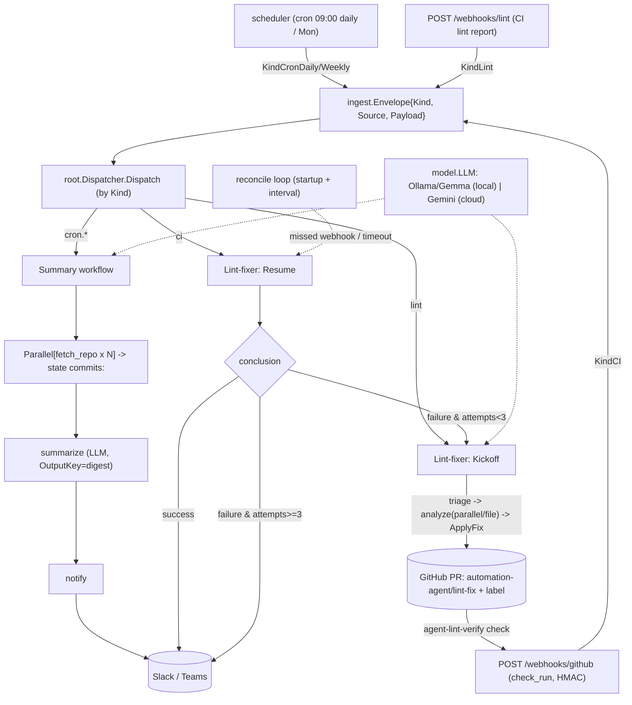

# automation-agent

This repository is a Go automation service built on the Agent Development Kit for
Go (`google.golang.org/adk`). Read [`docs/architecture.md`](docs/architecture.md)
first — it is the authoritative design.

## System flow

## Mental model

Ingest (cron / webhook / future hooks) → **root agent** (dispatcher) → one of two
workflow agents: **summary** (commit digests) or **lintfixer** (autonomous lint
remediation with a PR + CI loop). Deterministic, agent-free tooling lives under
`internal/` and is called by agents but never imports them.

## Conventions (enforced by `ARCH/` + `make ci`)

- **Every directory has an `AGENTS.md`.** Agent directories use one shared doc
  covering both `agents_setup.go` and `<name>.go`.
- **Build-agent pattern:** `agents_setup.go` is pure wiring (`Build<Name>Agent`);
  `<name>.go` holds testable logic. See `.agents/standards/agent-build-pattern.md`.
- **Import boundaries:** tooling must not import `internal/agent/...`; provider
  SDKs (Ollama/Gemini) only in `internal/agent/setup`; nothing imports `cmd`.
- **Prompts are markdown** under each agent's `prompts/` dir, loaded via `embed.FS`.
- **Testing:** ≥80% coverage (`make cover`). Never assert on LLM output content.
- **Models:** default to local Ollama Gemma; do not hardcode a provider in agents.

## Working here

- `make help` lists targets. `make ci` is the full local gate.
- New features/changes get a spec in `specs/` from a `.agents/templates` template
  (`make spec name=<slug> kind=<add|remove|change|migrate>`). `specs/` is gitignored.
