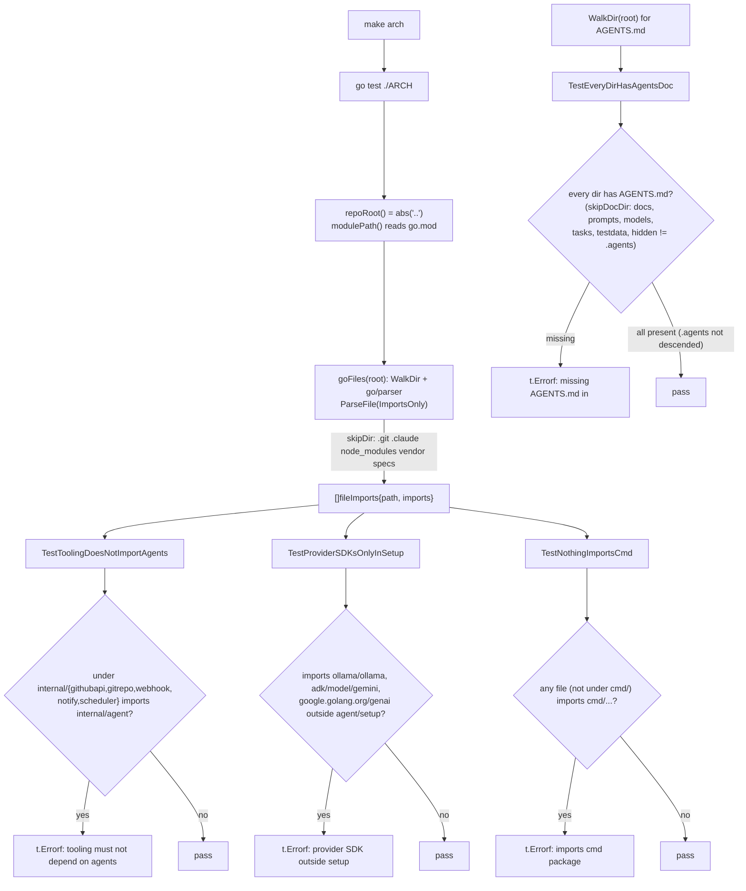

# ARCH

Architecture-conformance tests. Pure standard-library (no external deps) so they
run anywhere. Run with `make arch`.

## Flow

Current rules:

- `TestToolingDoesNotImportAgents` — `internal/{githubapi,gitrepo,webhook,notify,
  scheduler}` must not import `internal/agent/...`.
- `TestProviderSDKsOnlyInSetup` — Ollama/Gemini/genai imports are confined to
  `internal/agent/setup`.
- `TestNothingImportsCmd` — no package imports `cmd/...`.
- `TestEveryDirHasAgentsDoc` — every non-exempt directory has an `AGENTS.md`.

Add a new test here whenever we introduce a structural rule worth protecting.
