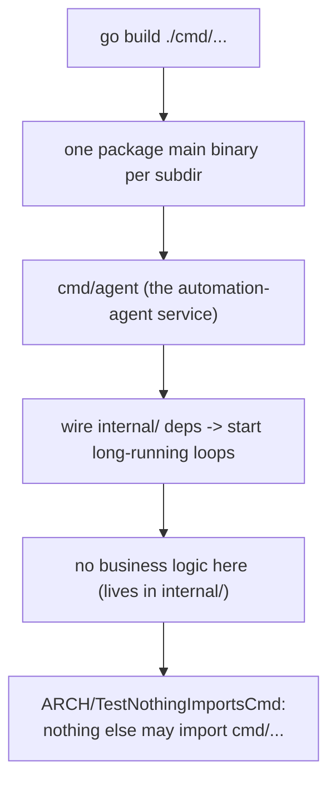

# cmd

Executable entrypoints. Each subdirectory is a `package main` binary.

## Flow

- `agent/` — the automation-agent service.

Entrypoints wire dependencies together and start long-running loops; they hold no
business logic (that lives in `internal/`). Nothing else in the repo may import
`cmd/...` (enforced by `ARCH/`).
