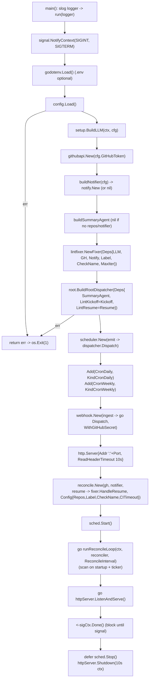

# cmd/agent

The service entrypoint. Responsibilities (built out across phases):

## Flow

1. Load `config`.
2. Build the LLM (`internal/agent/setup`), tooling, and the root/summary/lintfixer
   agents + runner.
3. Start the scheduler (cron) and the webhook HTTP server.
4. Run the reconcile loop and block until shutdown.

Keep this file thin — it is composition only. Anything testable belongs in
`internal/`. Phase 1 only loads config and logs startup.
