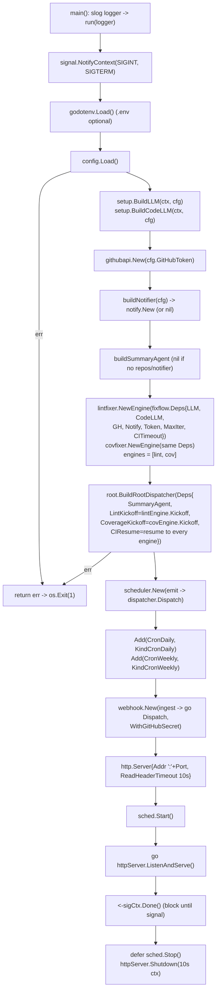

# cmd/agent

The service entrypoint. Responsibilities (built out across phases):

## Flow

1. Load `config`.
2. Build the LLM + code LLM (`internal/agent/setup`), the `githubapi` client and
   notifier, the summary agent, and the lint-fixer and coverage-fixer `fixflow`
   engines (sharing one `fixflow.Deps`, incl. `CITimeout`).
3. Build the root dispatcher (summary / lint kickoff / coverage kickoff / CI resume),
   then start the scheduler (daily + weekly cron) and the webhook HTTP server.
4. Block until shutdown (SIGINT/SIGTERM), then stop the scheduler and shut the server.

The fix loop is **in-memory and non-durable**: suspend/resume runs on an ADK
long-running `await_ci` tool + `fixflow`'s in-memory parked-run registry, with a per-run
`CI_TIMEOUT` bounding each wait. There is no reconcile loop, so a process restart
strands parked runs.

Keep this file thin — it is composition only. Anything testable belongs in
`internal/`.
