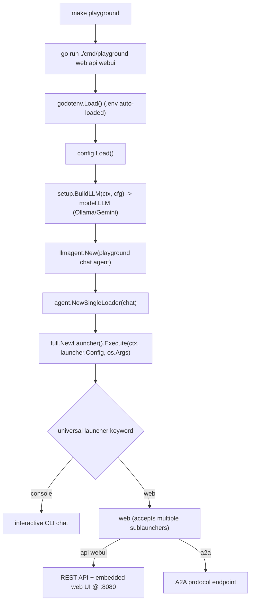

# cmd/playground

A local-only entrypoint that launches ADK's embedded web UI (or a one-shot CLI) to
interact with the configured model. **Development only** — a separate binary from
`cmd/agent`, so it is never in a production artifact, yet still compiled by
`go build ./...`/`make ci` (preferred over a build tag, which would hide breakage).

## Flow

Subcommands (from `full.NewLauncher` = `universal(console, web(webui, api, a2a, …))`):
the web UI needs **both** `api` and `webui`, so `make playground` runs `web api webui`
(per the ADK docs). `console` gives an interactive CLI. `.env` is auto-loaded.

To drive the real workflows interactively, swap the chat agent for the
`summary`/`lintfixer` agents in `main.go`. Not part of the prod deploy (which builds
only `./cmd/agent`).
