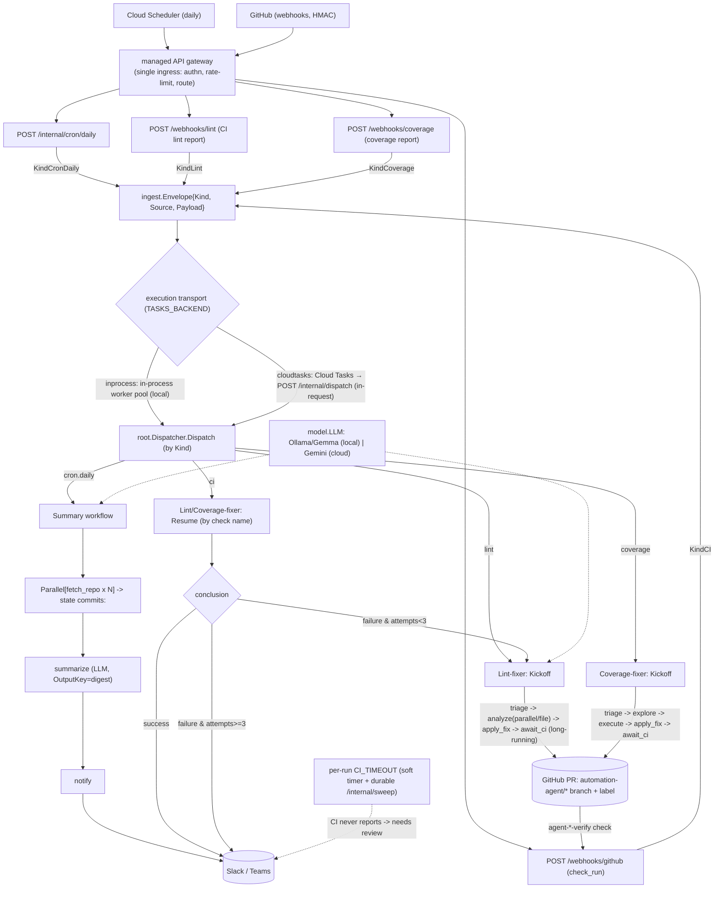
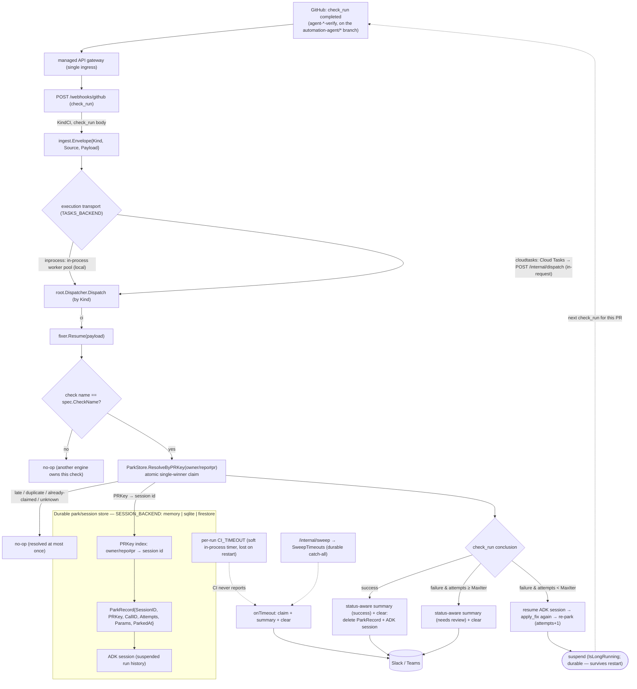

# automation-agent (Go / ADK)

This module is an automation service built on the Agent Development Kit (ADK)
(`google.golang.org/adk/v2` v2.0.0). Read [`../.agents/standards/architecture-design.md`](../.agents/standards/architecture-design.md)
first — it is the authoritative design.

## System flow

## Resume flow (detailed)

The system flow above is kickoff-centric: an event arrives and a workflow *starts*. A
fixer's **resume** is a separate, later request — the CI check for a parked run reports
back minutes-to-hours after kickoff and re-enters through the same front door. Only the
two fixers (lint, coverage) resume; the summary workflow is one-shot. This is the detail
behind the system flow's `PR → check_run → Resume` edge, including the durable `ParkStore`
lookup that reconnects the event to its suspended run.

Attempts are counted in the `ParkRecord`, **not** from GitHub commits. Because the claim
(`ResolveByPRKey` / `Sweep`) is atomic and single-winner, a late or duplicate webhook
racing the timeout timer or the sweep resolves the run at most once.

## Mental model

Ingest (cron / webhook / future hooks) → **root agent** (dispatcher) → one of three
workflow agents: **summary** (commit digests), **lintfixer** (autonomous lint
remediation with a PR + CI loop), or **covfixer** (test-coverage remediation, sharing
the `fixflow` engine). The PR + CI suspend/resume loop runs on ADK long-running tools
plus a `setup.ParkStore` of parked runs. Both the ADK `session.Service` and the
`ParkStore` are selected by `SESSION_BACKEND` (`memory` | `sqlite` | `firestore`,
default `memory`) and built once at startup in `internal/agent/setup`: with a durable
backend (sqlite/firestore) a restart no longer strands in-flight runs; `memory` keeps
the old ephemeral behavior. Webhook-triggered work is handed to the **execution
transport** (`internal/tasks`, switched by `TASKS_BACKEND`): `inprocess` runs it in an
in-process worker pool (local/default), while `cloudtasks` (prod) enqueues to Cloud Tasks
→ `POST /internal/dispatch` so the multi-minute compute runs **in-request** on Cloud Run
(CPU stays allocated; scale-to-zero preserved). Deterministic, agent-free tooling lives
under `internal/` and is called by agents but never imports them. For ops, env, and the
`/internal/*` hooks see [`../DEPLOYMENT.md`](../DEPLOYMENT.md).

## Conventions (enforced by `ARCH/` + `make ci`)

- **Every directory has an `AGENTS.md`.** Agent directories use one shared doc
  covering both `agents_setup.go` and `<name>.go`.
- **Build-agent pattern:** `agents_setup.go` is pure wiring (`Build<Name>Agent`);
  `<name>.go` holds testable logic. See `../.agents/standards/agent-build-pattern.md`.
- **Import boundaries:** tooling must not import `internal/agent/...`; provider
  SDKs (Ollama/Gemini) only in `internal/agent/setup`; nothing imports `cmd`.
- **Prompts are markdown** under each agent's `prompts/` dir, loaded via `embed.FS`.
- **Testing:** ≥80% coverage (`make cover`). Never assert on LLM output content.
- **Models:** default to local Ollama Gemma; do not hardcode a provider in agents.

## Working here

- `make help` lists targets. `make ci` is the full local gate (run from this `go/` dir).
- New features/changes get a spec in `../specs/` from a `../.agents/templates` template
  (`make spec name=<slug> kind=<add|remove|change|migrate>`). `specs/` is gitignored.
