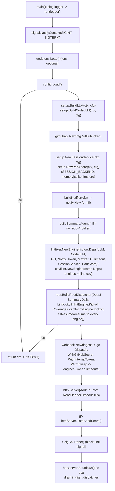

# cmd/agent

The service entrypoint. Responsibilities (built out across phases):

## Flow

1. Load `config`.
2. Build the LLM + code LLM (`internal/agent/setup`), the `githubapi` client, the
   `SESSION_BACKEND`-selected `session.Service` + `setup.ParkStore` (both built once
   here via `setup.NewSessionService`/`setup.NewParkStore`), the notifier, the summary
   agent, and the lint-fixer and coverage-fixer `fixflow` engines (sharing one
   `fixflow.Deps`, incl. `CITimeout`, `SessionService`, `ParkStore`).
3. Build the root dispatcher (summary / lint kickoff / coverage kickoff / CI resume),
   then start the webhook HTTP server (`WithInternalToken` + `WithSweep` enabling the
   `/internal/*` daily-cron + sweep hooks). The daily digest is driven by Cloud Scheduler
   calling `POST /internal/cron/daily`; the service runs no internal timer.
4. Block until shutdown (SIGINT/SIGTERM), then shut the server and drain in-flight dispatches.

The fix loop's durability follows `SESSION_BACKEND`: suspend/resume runs on an ADK
long-running `await_ci` tool + the injected `setup.ParkStore`, with a per-run
`CI_TIMEOUT` bounding each wait. With a durable backend (`sqlite`/`firestore`) parked
runs survive a restart and the durable `/internal/sweep` is the timeout catch-all; the
default `memory` backend is ephemeral (a restart strands parked runs). See
`../../../DEPLOYMENT.md` for the backends, the `/internal/*` hooks, and ops.

Keep this file thin — it is composition only. Anything testable belongs in
`internal/`.
