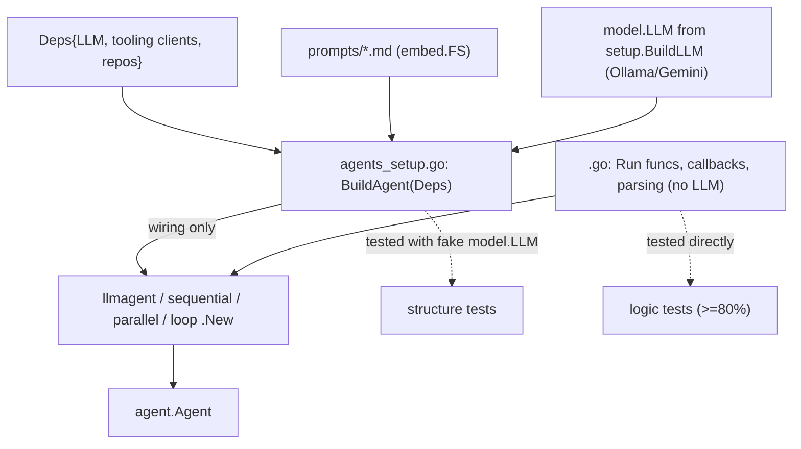

# internal/agent

The agents. Each workflow agent gets its own directory (`root/`, `summary/`,
`lintfixer/` — added in later phases), and shared utilities live in `setup/`.

## Flow

## The build-agent pattern (shared convention for every agent dir)

Each agent directory uses **one** `AGENTS.md` and two Go files:

- `agents_setup.go` — pure wiring: `Build<Name>Agent(d Deps) (agent.Agent, error)`,
  assembling ADK constructs from injected dependencies. No logic, no I/O.
- `<name>.go` — the testable behavior: code-agent `Run` funcs, tool impls,
  callbacks, parsing.

See `.agents/standards/agent-build-pattern.md`. Agents depend on the deterministic
tooling in `internal/...` and on `setup`; they never import `cmd`.

## Models

Agents receive a `model.LLM` from `setup.BuildLLM` — they must not import a
provider SDK directly. Default local backend is Ollama + Gemma; Gemini is the
cloud path. The switch is config-driven.

## Prompts

Each agent embeds its own `prompts/*.md` (`//go:embed`) and reads them via
`setup.NewPrompts`. Prompts are markdown, kept next to the agent.
