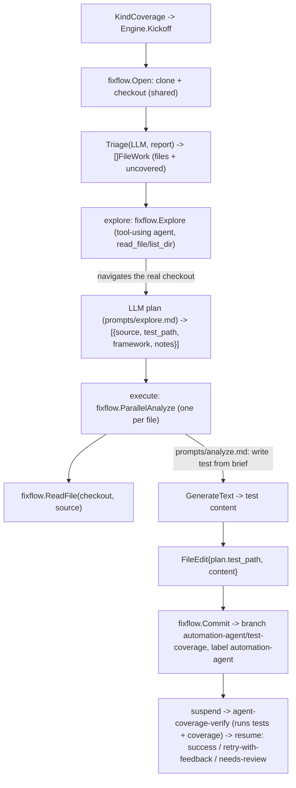

# internal/agent/covfixer

The **test-coverage** configuration of the `fixflow` engine. It triages an agnostic
coverage report into source files with meaningful uncovered logic, then generates
tests for them. Its prompts are entirely its own — separate from the lint-fixer's —
and only the deterministic loop is shared (`fixflow`).

**Test placement is never derived from a hardcoded rule.** The engine checks the repo
out once; an **explorer** examines the repo's *actual* existing tests to plan where
each test belongs and which framework to use, and parallel **executors** write the
tests from that grounded plan. The explorer is a tool-using LLM agent (`fixflow.Explore`):
the model itself navigates the checkout via `read_file`/`list_dir` to gather real
test-convention evidence — no Go code pre-selects the files it reads.

## Flow

## Files

- `coverage.go` — `NewEngine(Deps)`: the coverage `Spec` (branch/label/check + titles).
- `triage.go` — coverage report → `[]fixflow.FileWork` (files + uncovered regions).
- `analyze.go` — `explore` (a tool-using agent via `fixflow.Explore` grounds a per-file
  plan in the repo's real conventions) then `execute` (parallel test generation, reading
  each source with `fixflow.ReadFile`).
- `prompts/{triage,explore,analyze,summarize_result}.md`.

Generated tests that don't compile or don't raise coverage are rejected by the
`agent-coverage-verify` check and retried with the CI output as feedback — same loop
as the lint-fixer. Tested with a scripted LLM + a temp checkout; live behavior gated
behind `OLLAMA_LIVE`.
