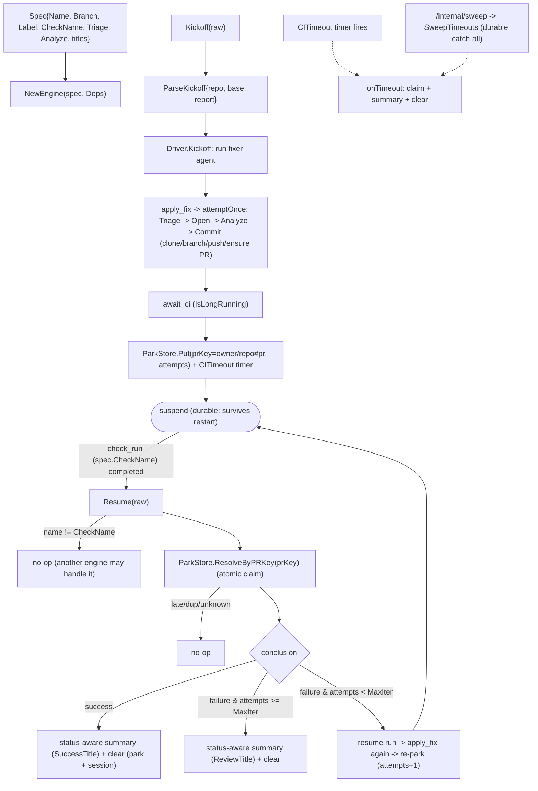

# internal/agent/fixflow

The reusable engine behind the PR-fixing agents (lint-fixer, coverage-fixer, …). It
owns the event-driven fix loop — kickoff → apply → **suspend across the CI wait** → CI
resume → loop or finish — plus the apply mechanics. Each concrete agent supplies a
`Spec` (its own triage fn, analyze fn, and branch/label/check names) **and its own
prompts**; nothing about the LLM prompting is shared here.

The CI wait is a real ADK **IsLongRunning** suspend/resume: the `Driver` runs a `fixer`
agent that calls `apply_fix` then parks on `await_ci`. Both the ADK session and the
parked run are persisted through `SESSION_BACKEND` (`memory` | `sqlite` | `firestore`):
the run is recorded in the injected `setup.ParkStore` (`ParkRecord` keyed by a UUID
session id, with a `owner/repo#pr` `PRKey` index for CI resume). With a durable backend
a process restart resumes in-flight runs; the default `memory` backend stays ephemeral
(a restart strands them). Attempts are counted in the park record — **not** from GitHub
commits. A run whose CI never reports is freed two ways: a soft per-run `CITimeout`
timer (in-process, lost on restart) and the durable `SweepTimeouts` catch-all (driven by
`/internal/sweep`). `ResolveByPRKey`/`Sweep` claim a run atomically (single winner), so
a late/duplicate webhook racing the timer/sweep resolves it at most once.

Terminal resolution (`clear`) deletes both the park record and the ADK session
(`LongRunDriver.DeleteSession`) so durable backends don't accumulate finished runs.

The outer loop is driven by a deterministic `setup.NewSequencerModel` (a dumb
apply→await emitter), so retry/stop/timeout policy is all in the `Driver`, not the
model. The substantive LLM work (triage, exploration, code edits) happens inside
`apply_fix` → `attemptOnce`.

## Flow

## Files

- `engine.go` — `Engine` + `Spec` + `Deps` + `FileWork`/`FileEdit`/`AnalyzeInput`;
  `Kickoff`/`Resume` (delegate to the Driver) + `attemptOnce` (one apply attempt).
- `driver.go` — `Driver`: the `apply_fix`/`await_ci` tools, the `fixer` agent (on a
  deterministic sequencer model), and the Kickoff/Resume/onTimeout/`SweepTimeouts`
  lifecycle over the injected `setup.ParkStore` (the in-memory `runRegistry` + `runs` map
  it replaced are gone). Terminal `clear` deletes the park record **and** the ADK session.
- `summary.go` — `buildSummaryText`: the status-aware terminal summary (success / max-iter
  / timeout framings) enriched with `GH.Compare` (base...branch diff) + the park record.
- `applyfix.go` — clone → branch (new/existing) → commit → push → ensure labeled PR.
- `analyze.go` — `ParallelAnalyze`: one ADK parallel agent per `FileWork`, distinct
  state keys so they never collide.
- `envelope.go` — the trusted `{repo, base, report}` kickoff envelope.
- `util.go` — `Engine.Label()`, `ExtractJSONArray/Object`, `StripFences`.

The generic suspend/resume plumbing (`LongRunDriver`, `NewSequencerModel`) lives in
`internal/agent/setup` (it touches `genai`, which ARCH confines to `setup`).

Multiple engines can each be handed a `check_run` event; only the one whose
`CheckName` matches acts. Tested with fake triage/analyze + a local seed repo + fakes,
driving the real ADK runner through park/resume.
