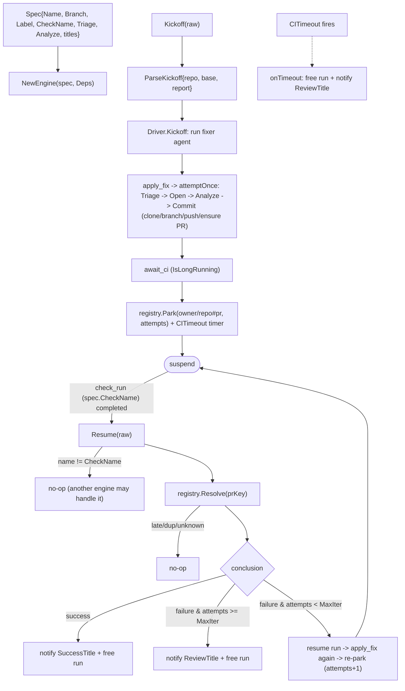

# internal/agent/fixflow

The reusable engine behind the PR-fixing agents (lint-fixer, coverage-fixer, …). It
owns the event-driven fix loop — kickoff → apply → **suspend across the CI wait** → CI
resume → loop or finish — plus the apply mechanics. Each concrete agent supplies a
`Spec` (its own triage fn, analyze fn, and branch/label/check names) **and its own
prompts**; nothing about the LLM prompting is shared here.

The CI wait is a real ADK **IsLongRunning** suspend/resume on an **in-memory** session:
the `Driver` runs a `fixer` agent that calls `apply_fix` then parks on `await_ci`. The
parked run is tracked in an in-memory **registry** (keyed by `owner/repo#pr`); there is
no durable store and no reconciler, so a process restart strands in-flight runs (an
accepted trade). Attempts are counted in the registry — **not** from GitHub commits.
A per-run `CITimeout` timer frees a run whose CI never reports.

The outer loop is driven by a deterministic `setup.NewSequencerModel` (a dumb
apply→await emitter), so retry/stop/timeout policy is all in the `Driver`, not the
model. The substantive LLM work (triage, exploration, code edits) happens inside
`apply_fix` → `attemptOnce`.

## Flow

## Files

- `engine.go` — `Engine` + `Spec` + `Deps` + `FileWork`/`FileEdit`/`AnalyzeInput`;
  `Kickoff`/`Resume` (delegate to the Driver) + `attemptOnce` (one apply attempt).
- `driver.go` — `Driver`: the `apply_fix`/`await_ci` tools, the `fixer` agent (on a
  deterministic sequencer model), and the Kickoff/Resume/onTimeout lifecycle over the
  registry.
- `registry.go` — in-memory parked-run registry; atomic `Resolve` (one of webhook/timer
  wins).
- `applyfix.go` — clone → branch (new/existing) → commit → push → ensure labeled PR.
- `analyze.go` — `ParallelAnalyze`: one ADK parallel agent per `FileWork`, distinct
  state keys so they never collide.
- `envelope.go` — the trusted `{repo, base, report}` kickoff envelope.
- `util.go` — `Engine.Label()`, `ExtractJSONArray/Object`, `StripFences`.

The generic suspend/resume plumbing (`LongRunDriver`, `NewSequencerModel`) lives in
`internal/agent/setup` (it touches `genai`, which ARCH confines to `setup`).

Multiple engines can each be handed a `check_run` event; only the one whose
`CheckName` matches acts. Tested with fake triage/analyze + a local seed repo + fakes,
driving the real ADK runner through park/resume.
