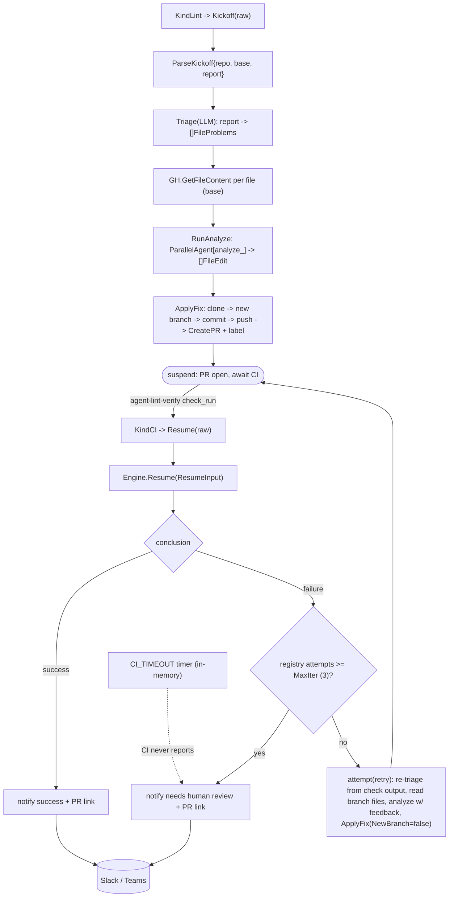

# internal/agent/lintfixer

The autonomous lint-remediation workflow. It is a configuration of the shared
`fixflow` engine: its own triage/analyze functions and prompts, on `fixflow`'s
deterministic kickoff → suspend → CI resume → loop or finish loop. The wait is a real
ADK long-running suspend/resume (the `await_ci` tool) because CI takes 20–40 min. The
parked run is tracked in `fixflow`'s **in-memory** parked-run registry (keyed by
`owner/repo#pr`); there is no durable store, so a process restart strands in-flight
runs, and a per-run `CI_TIMEOUT` timer (default 90m) bounds each wait.

## Flow

- **Kickoff** (`KindLint`) → `Engine.Kickoff`: parse the trusted `{repo, base, report}`
  envelope → `Triage` (LLM normalizes the arbitrary report) → fetch file contents →
  analyze (one parallel agent per file) → `apply_fix` (branch, commit, push,
  labeled PR) → suspend on `await_ci`.
- **Resume** (`KindCI`) → `Engine.Resume` (the `fixflow` Driver): on the agent verify
  check completing — success → notify; failure & attempts < max → re-analyze with CI
  feedback and push onto the same branch; failure & attempts ≥ max → notify "needs
  human review" + PR link. Attempts are counted in `fixflow`'s in-memory registry, not
  derived from GitHub SHAs. There is no reconcile loop: a parked run whose CI never
  reports is freed by its per-run `CI_TIMEOUT` timer (→ "needs human review").

## Files

- `lint.go` — `NewEngine(fixflow.Deps)`: the lint `Spec` (branch/label/check + titles)
  that configures the shared `fixflow` engine.
- `triage.go` — LLM report normalization (format-agnostic; live-proven).
- `analyze.go` — parallel per-file fix agents (live-proven).
- `prompts/{triage,analyze,summarize_result}.md`.

The kickoff/suspend/resume mechanics (apply_fix → await_ci, the in-memory registry,
attempt counting, the CI timeout) live in the shared `fixflow` package.

Wiring: `root` registers `KindLint`/`KindCI`; `cmd` builds the engine (via `NewEngine`),
the scheduler, and the webhook server. Provider SDKs (genai) are kept out via `setup`
helpers. Tests use a stub/scripted LLM + fakes + a local seed repo; live LLM tests
are gated behind `OLLAMA_LIVE`. See `docs/architecture.md` §8.
