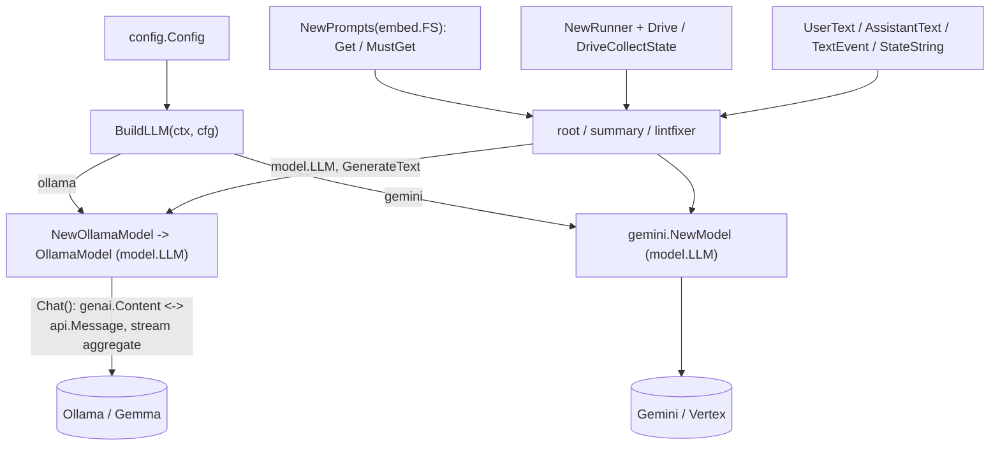

# internal/agent/setup

Shared utilities for building agents. **This is the only package allowed to import
provider / infrastructure SDKs** — the LLM providers (Ollama, Gemini, genai) **and** the
durable session/park backends (`adk/session/database`, `glebarez/sqlite`, `gorm`,
`cloud.google.com/go/firestore`) — enforced by `ARCH/`.

It owns two provider-switched seams, both selected by `SESSION_BACKEND` and built once at
startup: the LLM (`BuildLLM`), the ADK `session.Service` (`NewSessionService`), and the
`ParkStore` (`NewParkStore`) — `memory` | `sqlite` | `firestore`.

## Flow

- `llm.go` — `BuildLLM(ctx, cfg)`: the provider switch returning a `model.LLM`.
- `ollama.go` — `OllamaModel`, the `model.LLM` adapter over the official Ollama Go
  client (`github.com/ollama/ollama/api`). Converts genai content ⇄ Ollama chat
  messages and aggregates streaming chunks. adk-go has no built-in Ollama model,
  so this adapter provides one.
- `gemini.go` — the Gemini-backed `model.LLM` for the cloud deployment.
- `prompt.go` — `Prompts`, a markdown loader over an `fs.FS` (each agent embeds its
  own `prompts/` dir).
- `events.go` — small genai content helpers (`UserText`, `ContentText`, `LastText`).
- `runner.go` — runner helpers (`NewRunner` over an in-memory session for the ephemeral
  explore/analyze/root runs, `Drive`, `DriveText`, `DriveCollectState`).
- `longrun.go` — generic ADK **IsLongRunning** suspend/resume plumbing: `LongRunDriver`
  (`Start`/`Resume` returning a plain `DriveResult`, over an injected `session.Service`;
  `DeleteSession` for terminal cleanup) and `NewSequencerModel`, a deterministic
  Action→Wait `model.LLM` for two-phase wait loops. Lives here because it touches `genai`;
  callers (e.g. `fixflow`) stay genai-free.
- `session.go` — `NewSessionService(ctx, cfg)`: the durable suspend/resume **history**
  backend switch (`memory` = `InMemoryService`; `sqlite` = adk `session/database`;
  `firestore` = `session_firestore.go`).
- `session_firestore.go` — a hand-rolled Firestore `session.Service` (adk-go ships none;
  the official one is Java-only). Five methods with app:/user:/temp: state scopes;
  validated against adk's own `session_test.RunServiceTests` via the emulator.
- `parkstore.go` / `parkstore_sqlite.go` / `parkstore_firestore.go` — the `ParkStore`
  interface + `ParkRecord` and its `memory` / `sqlite` / `firestore` backends. The park
  record (prKey→session, attempts, serialized run params) that a CI webhook needs to
  resume the right run; atomic single-winner `ResolveByPRKey`/`Sweep`. `NewParkStore(ctx,
  cfg)` selects the backend.
- The spike (`durable_resume_test.go`) proves cross-process resume; conformance suites
  cover all three park/session backends (firestore behind `FIRESTORE_EMULATOR_HOST`).

Tests stub the Ollama HTTP server (`httptest`) and use `fstest.MapFS` for prompts —
no real network, no live model. Never assert on LLM output content.
