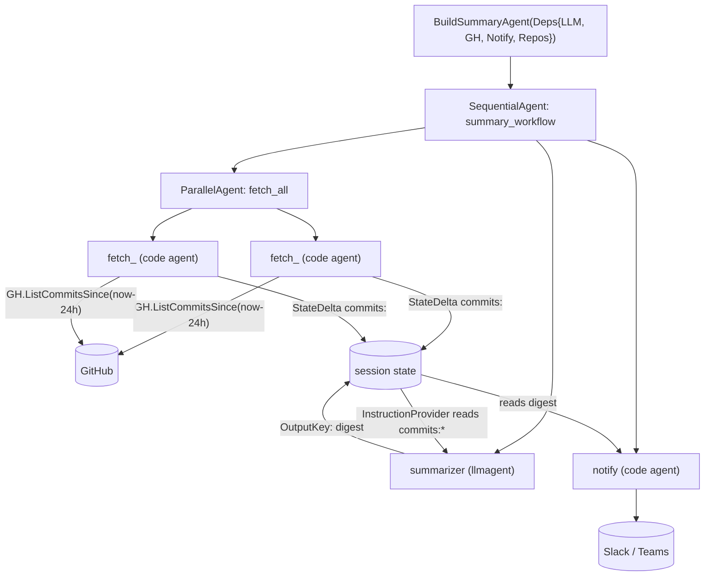

# internal/agent/summary

The summary workflow agent. Build-agent pattern:

## Flow

- `agents_setup.go` — `BuildSummaryAgent(Deps)` wires
  `Sequential[ Parallel[fetch×N] -> summarize(LLM) -> notify ]`. Pure wiring.
- `summary.go` — the testable logic: per-repo fetch code-agents, the notify
  code-agent, `formatCommits`, and the summarizer's `InstructionProvider`.
- `prompts/summarize.md` — the summarizer instruction (markdown, embedded).

## Data flow

Each parallel fetcher writes its repo's commit digest to state under
`commits:<owner/repo>`. The summarizer's instruction provider reads all `commits:*`
keys, appends them to the prompt, and the model writes the digest to state under
`digest` (its `OutputKey`). The notifier reads `digest` and posts it.

`CommitLister` is a consumer-defined interface over `githubapi` (fakeable). Tests
cover the deterministic helpers and structure; an `OLLAMA_LIVE` test runs the whole
workflow end-to-end against real Gemma. Never assert on LLM output content.
