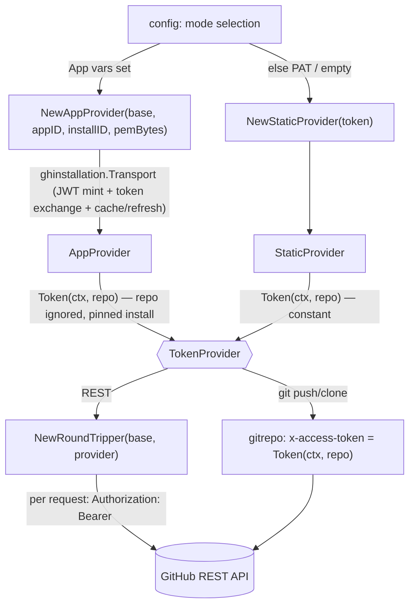

# internal/auth

The GitHub authentication seam. One interface, `TokenProvider`, hides whether a
token comes from a static PAT (local-dev fallback) or a freshly minted GitHub App
installation token (production). See
`specs/20260625-github-app-authentication.md`.

## Flow

- `TokenProvider.Token(ctx, repo)` — the seam. `repo` is `"owner/name"`. PAT mode
  returns the same constant for every repo; App mode mints/caches a short-lived
  (~1h) installation token and refreshes it before expiry. The seam is the
  **cross-port contract** (`language-parity.md`); the library is per-port detail.
- `StaticProvider` — constant token. Backs the PAT fallback and the empty
  (anonymous, public-read/test) client. An empty token is valid.
- `AppProvider` — wraps `ghinstallation/v2.Transport` pinned to **one**
  installation id (single-org per deployment — spec §1), so there is no per-owner
  cache and no dynamic `repo→installation` resolution. The `repo` argument is
  accepted for the contract but ignored. `WithBaseURL` overrides the token-exchange
  endpoint for tests.
- `NewRoundTripper(base, provider)` — bridges the seam to the go-github REST client:
  it injects `Authorization: Bearer <token>` on a clone of each request (an empty
  token is left unauthenticated). The provider's cache means this stays cheap.

Mode selection and PEM/env handling live in `config` (not here): this package only
consumes already-resolved app id / installation id / private-key bytes / PAT.
Deterministic tooling — no agent imports. Tested with a throwaway RSA key + an
`httptest` stub for the token exchange (no live network, no LLM).
