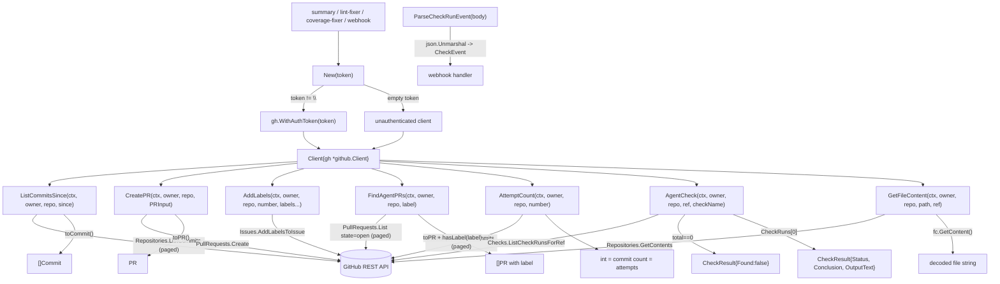

# internal/githubapi

A thin wrapper over `go-github/v78` exposing only what this service needs:

## Flow

- `ListCommitsSince` — last-24h commit digests (summary workflow).
- `CreatePR` / `AddLabels` — open and label the agent's fix PR.
- `FindAgentPRs` — open PRs with the agent label (used by `apply_fix` to reuse an
  existing labeled agent PR instead of opening a duplicate).
- `AttemptCount` — commits on a PR = distinct agent-pushed SHAs (one commit per
  attempt; re-run-safe). See `.agents/standards/architecture-design.md` §8.
- `AgentCheck` — the agent verify check's status/conclusion for a ref (resume).

Owner/repo are per-call so one client serves many repos. Deterministic tooling — no
agent imports. Tested by pointing a real `*github.Client` at an `httptest` stub
(go-github's `BaseURL` override pattern). Consumers define their own narrow
interfaces over this client for faking.
