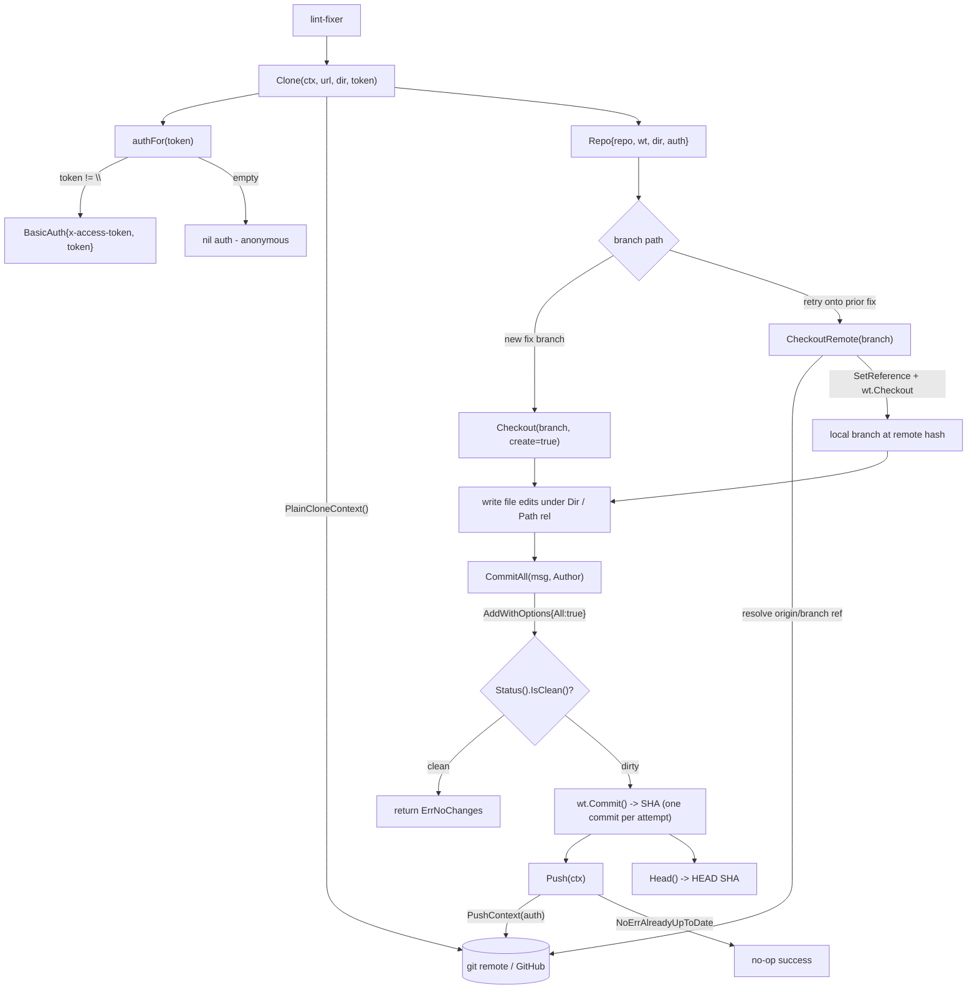

# internal/gitrepo

Working-tree git operations via `go-git/v5` (pure Go, no git binary):

## Flow

- `Clone(ctx, url, dir, token)` — token becomes GitHub `x-access-token` HTTP auth.
- `Checkout(branch, create)`, `CommitAll(msg, author)` (stages all, returns SHA),
  `Push(ctx)`, `Head()`, `Path(rel)`.

The lint-fixer writes file edits under `Dir()`, then `CommitAll` + `Push`. The
invariant **one commit per attempt** lets `githubapi.AttemptCount` derive the
iteration count. PR creation lives in `githubapi` (an API op, not a git op).

Deterministic tooling — no agent imports. Tested against a local seed repo, so it
exercises real clone/branch/commit/push without network.
