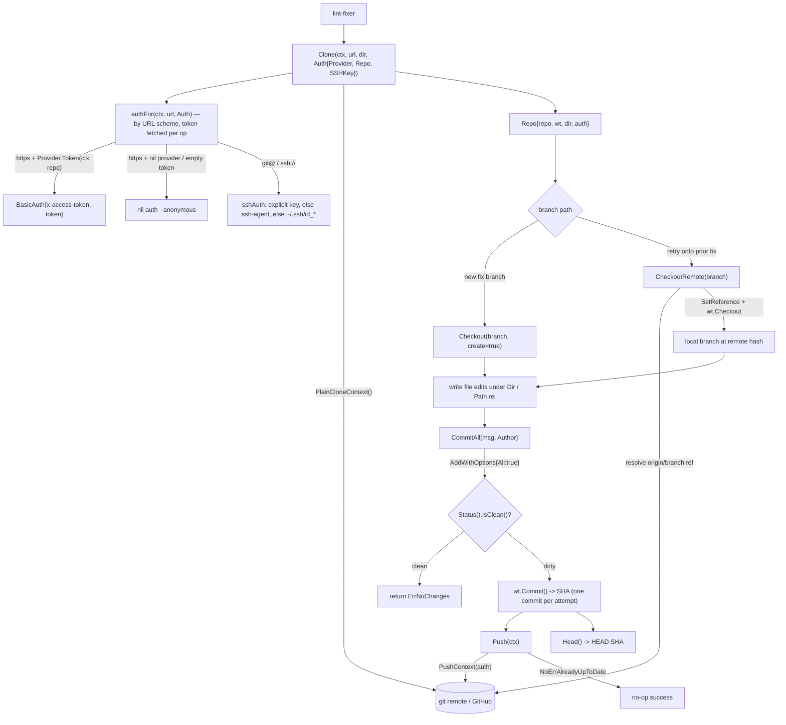

# internal/gitrepo

Working-tree git operations via `go-git/v5` (pure Go, no git binary):

## Flow

- `Clone(ctx, url, dir, Auth{Provider, Repo, SSHKey})` — auth is chosen by the URL scheme,
  not the caller: an `https` remote uses `Provider.Token(ctx, Repo)` (GitHub
  `x-access-token` basic auth, or anonymous when the provider is nil / yields ""); a
  `git@…`/`ssh://…` remote uses `SSHKey` if set, else a running ssh-agent, else the first
  default identity file (`~/.ssh/id_ed25519|id_rsa|id_ecdsa`). Host-key checking stays on
  (go-git defaults the callback to the user's `known_hosts`). The scheme is selected
  upstream by `GIT_TRANSPORT` (the engine builds the `git@github.com:…` URL).
- The token is fetched **per git operation** — `Clone` *and* `Push` each call the provider
  — so a short-lived GitHub App installation token (~1h) is always current rather than
  captured stale at clone time. `Provider` is the gitrepo-local `TokenProvider` interface,
  satisfied by `internal/auth`'s static (PAT) and App providers.
- `Checkout(branch, create)`, `CommitAll(msg, author)` (stages all, returns SHA),
  `Push(ctx)` (re-resolves auth), `Head()`, `Path(rel)`.

The lint-fixer writes file edits under `Dir()`, then `CommitAll` + `Push`. The
invariant is **one commit per attempt**; the iteration count is tracked in the
`setup.ParkStore` record, not derived from git history. PR creation lives in
`githubapi` (an API op, not a git op).

Deterministic tooling — no agent imports. Tested against a local seed repo, so it
exercises real clone/branch/commit/push without network.
