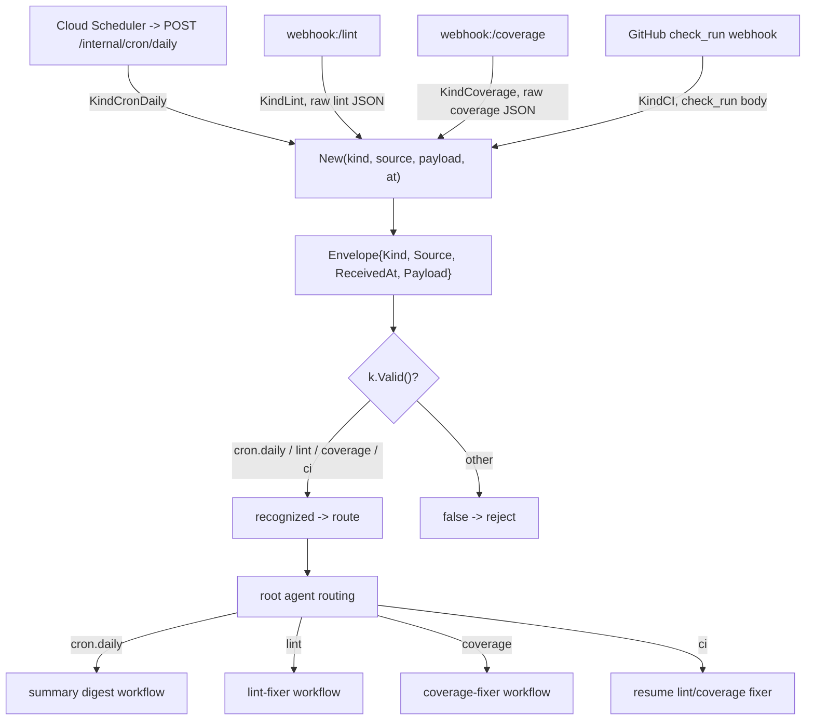

# internal/ingest

The normalized `Envelope` that every ingress source is reduced to before reaching
the root agent. `Kind` identifies the trigger (cron.daily, lint, coverage, ci);
`Payload` carries the raw source body for the chosen workflow to parse.

## Flow

Adding a new ingress (e.g. Jira) means adding a `Kind` here and a handler that emits
an `Envelope` — the root agent's routing is the only other place that changes.

## Wire codec

`Encode`/`Decode` are the envelope's JSON wire form, used when it crosses the Cloud Tasks
boundary (`internal/tasks` → `POST /internal/dispatch`). The form — `kind`/`source`
strings, `received_at` RFC 3339, `payload` standard base64 — is an external contract and
must stay byte-identical across all four language ports. `Decode` rejects an unknown
`Kind` as a permanent (poison) error so the worker acks rather than retries it. The
in-process transport passes the struct directly and never touches the codec.
