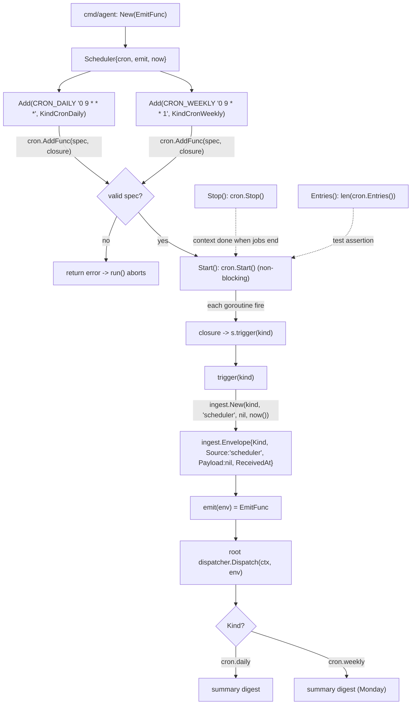

# internal/scheduler

Wraps `robfig/cron/v3` to emit `ingest.Envelope`s on a schedule, so time triggers
flow through the same root-agent path as any other ingress.

## Flow

- `Add(spec, kind)` registers a 5-field cron spec (e.g. `0 9 * * *` daily,
  `0 9 * * 1` Mondays).
- `trigger` is factored out of the cron closure so the emit path is unit-testable
  without waiting on real time; `now` is injectable.

Note: the Monday lint trigger is expected to come from an external CI job posting to
`/webhooks/lint`, not from a cron here — see `.agents/standards/architecture-design.md` §8.

This **in-process** scheduler is one of two ways to drive the digests. The other is
**Cloud Scheduler** → `POST /internal/cron/{daily,weekly}` (see `internal/webhook` +
`DEPLOYMENT.md`), which lets Cloud Run scale to zero. Use **one** of them — running both
double-fires the digests (caution noted in `DEPLOYMENT.md`).
