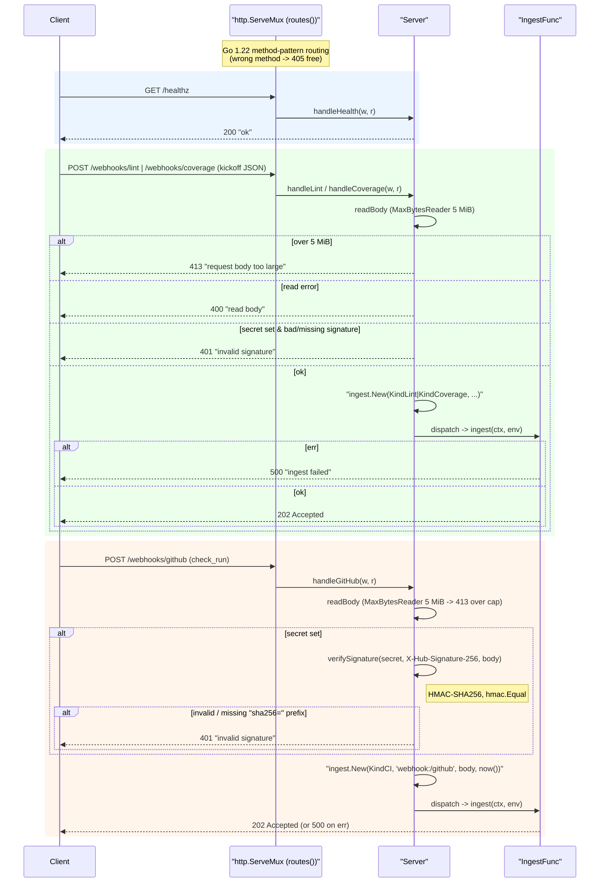

# internal/webhook

The HTTP ingress. The `/webhooks/*` POST endpoints reduce requests to an `ingest.Envelope`
and hand them to an `IngestFunc` (which should enqueue via the `tasks` transport and return
fast); the `/internal/*` endpoints are the **Cloud Scheduler** ingress (the daily digest +
the durable timeout sweep) plus the **Cloud Tasks** worker (`/internal/dispatch`). Every
`/webhooks/*` POST is HMAC-authenticated with `X-Hub-Signature-256` when a secret is
configured — the `/webhooks/lint` and `/webhooks/coverage` kickoffs as well as
`/webhooks/github`, because a kickoff selects a caller-supplied target repo.

## Flow

- `POST /webhooks/lint` — lint-fixer **kickoff** (agnostic lint JSON) → `KindLint`.
- `POST /webhooks/coverage` — coverage-fixer **kickoff** (agnostic coverage report) → `KindCoverage`.
- `POST /webhooks/github` — lint/coverage-fixer **resume** (GitHub `check_run`) → `KindCI`.
- `GET /healthz` — liveness.
- `POST /internal/cron/daily` — Cloud Scheduler trigger for the daily summary digest
  (`KindCronDaily`); lets the schedule live GCP-side so Cloud Run scales to zero.
- `POST /internal/sweep` — Cloud Scheduler trigger for the durable timeout sweep
  (`SweepFunc` → `Engine.SweepTimeouts`), the restart-proof catch-all behind the soft timer.
- `POST /internal/dispatch` — the **Cloud Tasks worker** (`DispatchFunc`, wired via
  `WithDispatch`). It decodes the queued `ingest.Envelope` and runs `dispatcher.Dispatch`
  **synchronously, in-request**, so on Cloud Run CPU stays allocated for the whole compute
  (a post-202 goroutine would be throttled). Because that compute runs for minutes — far
  longer than the server `WriteTimeout` sized for the fast webhook handlers — the handler
  **clears this connection's write deadline** so a slow-but-successful dispatch still delivers
  its 2xx (a lost response would make Cloud Tasks retry completed work). Retry classification
  follows Cloud Tasks'
  retry-on-non-2xx contract: a transient dispatch error → `500` (the queue retries with
  backoff); a poison body (undecodable / unknown `Kind`) → `200` + log (acked so the queue
  drops it instead of looping). Returns `501` when no dispatcher is wired. See
  `specs/20260626-workflow-execution-transport.md` and `internal/tasks`.

The `/webhooks/*` POSTs are HMAC-verified via `X-Hub-Signature-256` when a secret is
configured (skipped only when unset, for local dev) — the kickoffs included, since they
pick the target repo. The `/internal/*` endpoints use a **Bearer token** (`INTERNAL_TOKEN`)
and are **disabled (404)** unless that token is set (`internalAuthenticated`); the Cloud
Tasks transport attaches that same token, so `/internal/dispatch` reuses the check verbatim.
See `DEPLOYMENT.md` for the bearer-vs-OIDC rationale. Go 1.22 method-pattern routing gives
405s for free. Bodies are size-capped at 5 MiB (over-cap → `413`, not truncated).
Deterministic tooling — no agent imports. Fully tested with `httptest`.
