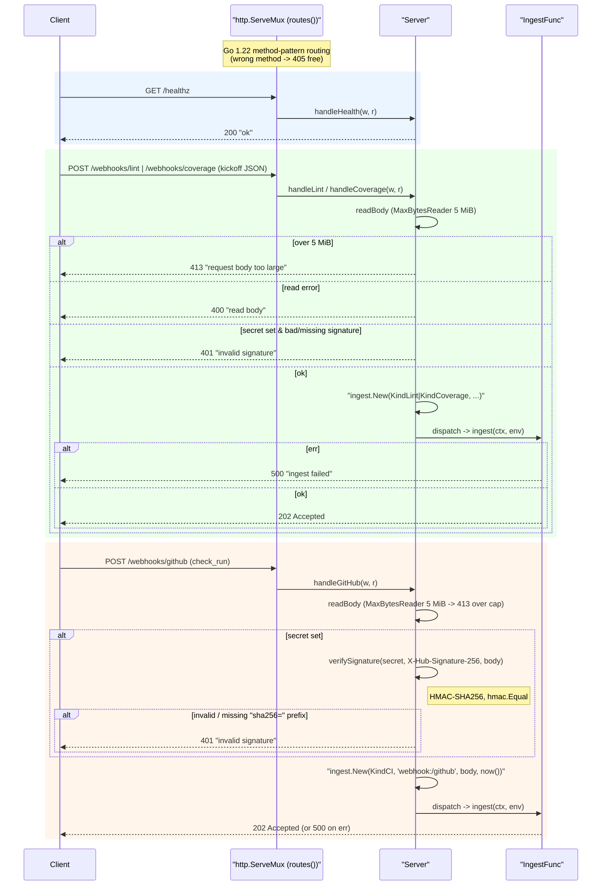

# internal/webhook

The HTTP ingress. Three POST endpoints reduce requests to an `ingest.Envelope` and hand
them to an `IngestFunc` (which should enqueue and return fast). Every POST endpoint is
HMAC-authenticated with `X-Hub-Signature-256` when a secret is configured — the
`/webhooks/lint` and `/webhooks/coverage` kickoffs as well as `/webhooks/github`,
because a kickoff selects a caller-supplied target repo.

## Flow

- `POST /webhooks/lint` — lint-fixer **kickoff** (agnostic lint JSON) → `KindLint`.
- `POST /webhooks/coverage` — coverage-fixer **kickoff** (agnostic coverage report) → `KindCoverage`.
- `POST /webhooks/github` — lint/coverage-fixer **resume** (GitHub `check_run`) → `KindCI`.
- `GET /healthz` — liveness.

All three POST endpoints are HMAC-verified via `X-Hub-Signature-256` when a secret is
configured (skipped only when unset, for local dev) — the kickoffs included, since they
pick the target repo. Go 1.22 method-pattern routing gives 405s for free. Bodies are
size-capped at 5 MiB (over-cap → `413`, not truncated). Deterministic tooling — no agent
imports. Fully tested with `httptest`.
