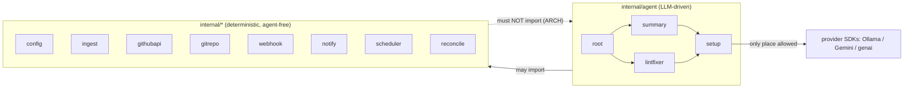

# internal

All non-entrypoint code. Two families:

- **Agents** (`agent/`) — the LLM-driven workflow agents and their shared `setup`
  utilities.
- **Tooling** (`config`, `ingest`, `githubapi`, `gitrepo`, `webhook`, `notify`,
  `scheduler`, `reconcile`) — deterministic, unit-testable, **agent-free**. These
  must not import `agent/...` (enforced by `ARCH/`).

## Flow

This separation is what keeps the system testable to ≥80% coverage: the hard logic
lives in tooling and in agents' `<name>.go` files, both injectable and LLM-free.
