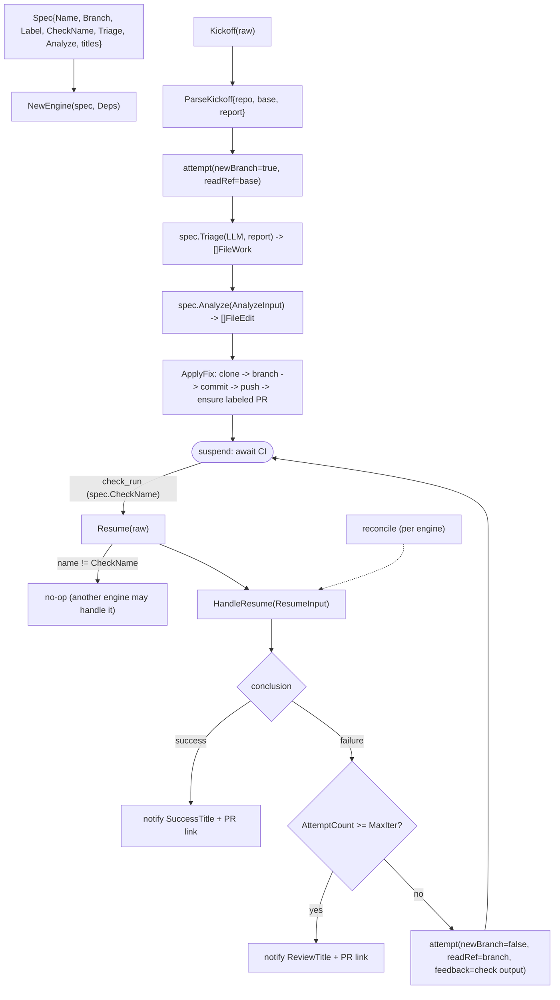

# internal/agent/fixflow

The reusable engine behind the PR-fixing agents (lint-fixer, coverage-fixer, …). It
owns the **deterministic** event-driven loop — kickoff → suspend → CI resume → loop
or finish — plus the apply mechanics and attempt counting. Each concrete agent
supplies a `Spec` (its own triage fn, analyze fn, and branch/label/check names) **and
its own prompts**; nothing about the LLM prompting is shared here. State lives on
GitHub; there is no local store (see `docs/architecture.md` §8).

## Flow

## Files

- `engine.go` — `Engine` + `Spec` + `Deps` + `FileWork`/`FileEdit`/`AnalyzeInput` +
  Kickoff/Resume/HandleResume/attempt.
- `applyfix.go` — clone → branch (new/existing) → commit → push → ensure labeled PR.
- `analyze.go` — `ParallelAnalyze`: one ADK parallel agent per `FileWork`, each
  calling the workflow's `EditFunc`, distinct state keys so they never collide.
- `envelope.go` — the trusted `{repo, base, report}` kickoff envelope.
- `util.go` — `Engine.Label()`, `ExtractJSONArray/Object`, `StripFences`.

Multiple engines can each be handed a `check_run` event; only the one whose
`CheckName` matches acts. Tested with fake triage/analyze + a local seed repo + fakes.
