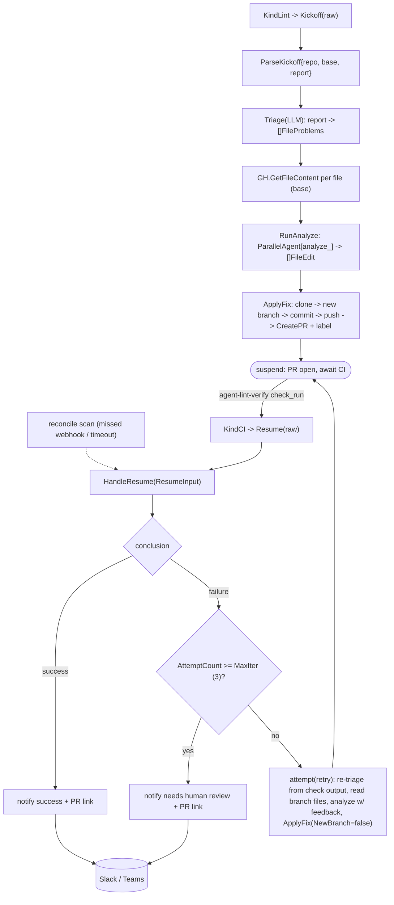

# internal/agent/lintfixer

The autonomous lint-remediation workflow. The loop is **event-driven across webhook
invocations** (kickoff → suspend → CI resume → loop or finish), not an in-process
ADK loop, because CI takes 20–40 min. State lives on GitHub (label + check/SHA
history); there is no local store.

## Flow

- **Kickoff** (`KindLint`) → `Fixer.Kickoff`: parse the trusted `{repo, base, report}`
  envelope → `Triage` (LLM normalizes the arbitrary report) → fetch file contents →
  `RunAnalyze` (one parallel agent per file) → `ApplyFix` (branch, commit, push,
  labeled PR) → suspend.
- **Resume** (`KindCI`) → `Fixer.Resume`/`HandleResume`: on the agent verify check
  completing — success → notify; failure & attempts < max → re-triage from the check
  output, re-analyze with CI feedback, push onto the same branch; failure & attempts
  ≥ max → notify "needs human review" + PR link. Attempt count = distinct
  agent-pushed SHAs (`githubapi.AttemptCount`). Recovery for missed webhooks comes
  from `reconcile`, which calls `HandleResume`.

## Files

- `lintfixer.go` — the `Fixer` orchestrator (kickoff/resume/attempt).
- `triage.go` — LLM report normalization (format-agnostic; live-proven).
- `analyze.go` — parallel per-file fix agents (live-proven).
- `applyfix.go` — clone → branch (new or existing) → commit → push → ensure labeled PR.
- `models/payload.go` — the trusted `{repo, base, report}` kickoff envelope.
- `prompts/{triage,analyze,summarize_result}.md`.

Wiring: `root` registers `KindLint`/`KindCI`; `cmd` builds the `Fixer`, the reconcile
loop, and the webhook server. Provider SDKs (genai) are kept out via `setup`
helpers. Tests use a stub/scripted LLM + fakes + a local seed repo; live LLM tests
are gated behind `OLLAMA_LIVE`. See `docs/architecture.md` §8.
