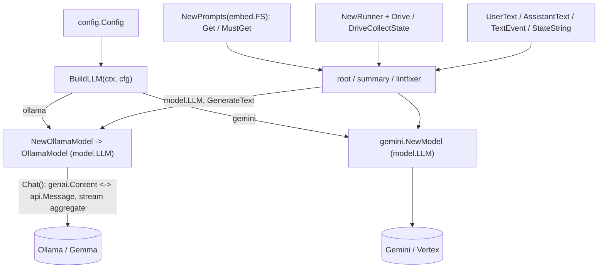

# internal/agent/setup

Shared utilities for building agents. **This is the only package allowed to import
provider SDKs** (Ollama, Gemini, genai) — enforced by `ARCH/`.

## Flow

- `llm.go` — `BuildLLM(ctx, cfg)`: the provider switch returning a `model.LLM`.
- `ollama.go` — `OllamaModel`, the `model.LLM` adapter over the official Ollama Go
  client (`github.com/ollama/ollama/api`). Converts genai content ⇄ Ollama chat
  messages and aggregates streaming chunks. adk-go has no built-in Ollama model
  (that exists only in Python via LiteLLM), so this adapter is the Go path.
- `gemini.go` — the Gemini-backed `model.LLM` for the cloud deployment.
- `prompt.go` — `Prompts`, a markdown loader over an `fs.FS` (each agent embeds its
  own `prompts/` dir).
- `events.go` — small genai content helpers (`UserText`, `ContentText`, `LastText`).

Tests stub the Ollama HTTP server (`httptest`) and use `fstest.MapFS` for prompts —
no real network, no live model. Never assert on LLM output content.
