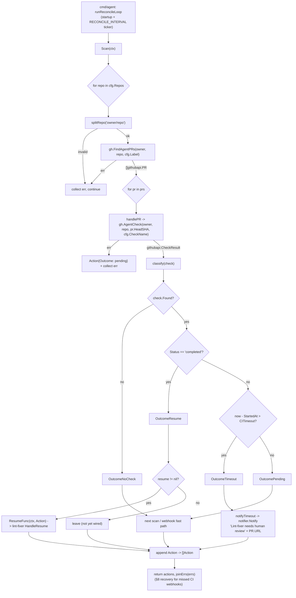

# internal/reconcile

The stateless recovery scan — GitHub is the source of truth, so there is no local
store. On startup and on a timer (`RECONCILE_INTERVAL`), `Scan` lists labeled PRs
per repo and reads each one's agent verify check, classifying each into:

## Flow

- `resume` — check completed → call `ResumeFunc` (lint-fixer decides pass/fail).
- `timeout` — pending past `CITimeout` → notify "needs human review" + PR link.
- `pending` / `nocheck` — leave for the next scan or the webhook fast path.

Consumer-defined `GitHub` interface (faked in tests). `ResumeFunc` is wired by the
lint-fixer in a later phase. Deterministic tooling — no agent imports. Fully tested
with fakes; per-repo errors are collected, not fatal.
