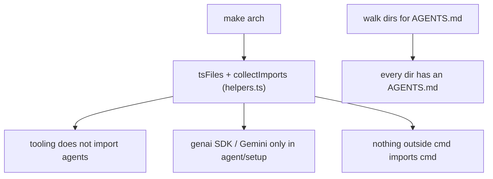

# arch

Architecture-conformance tests, run with `make arch` (Vitest). They scan each module's
import statements (no type-checker needed) and assert the project's boundaries.

Current rules:

- **tooling does not import agents** (`arch.test.ts`) —
  `src/{githubapi,gitrepo,webhook,notify,scheduler}` must not import `src/agent/...`.
- **provider SDK confined to setup** (`arch.test.ts`) — the `@google/genai` SDK and the
  `Gemini` model are imported only from `src/agent/setup`.
- **nothing imports cmd** (`arch.test.ts`) — no module outside `cmd/` imports `cmd/...`.
- **every dir has an AGENTS.md** (`docs.test.ts`) — every non-exempt directory carries one.

`helpers.ts` holds the file/import scanning utilities. Add a new test here whenever a
structural rule is worth protecting.
