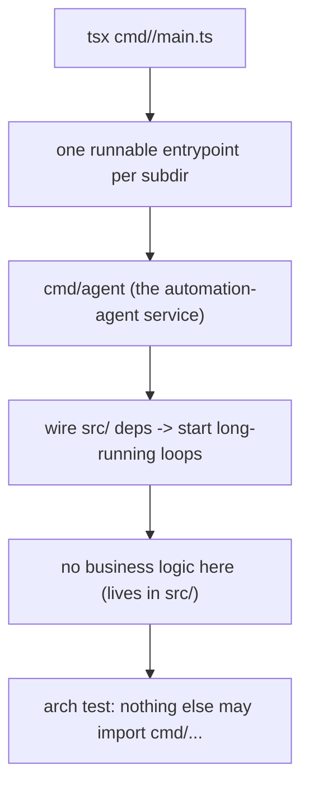

# cmd

Executable entrypoints. Each subdirectory is a runnable module (`tsx cmd/<name>/main.ts`).

- `agent/` — the automation-agent service.
- `playground/` — a local dev REPL over the configured model (never deployed).

Entrypoints wire dependencies together and start long-running loops; they hold no
business logic (that lives in `src/`). Nothing else in the repo may import `cmd/...`
(enforced by `arch/`).
