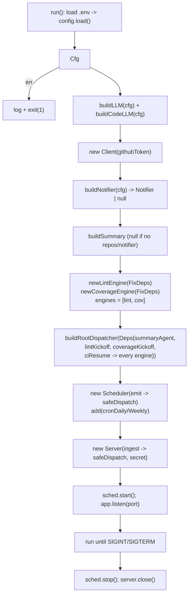

# cmd/agent

The service entrypoint. Responsibilities:

1. Load `config`.
2. Build the LLMs (`src/agent/setup`), tooling, and the root + summary agents plus the
   lint-fixer and coverage-fixer `fixflow` engines.
3. Start the scheduler (croner) and the webhook HTTP server (Express).
4. Run until interrupted, then stop the scheduler and close the server.

The fix loop is non-durable and in-memory (ADK long-running suspend/resume + `fixflow`'s
in-memory parked-run registry, with a per-run `CI_TIMEOUT` bounding each wait); there is
no reconcile loop, so a restart strands parked runs.

Keep this module thin — it is composition only. Anything testable belongs in `src/`.
