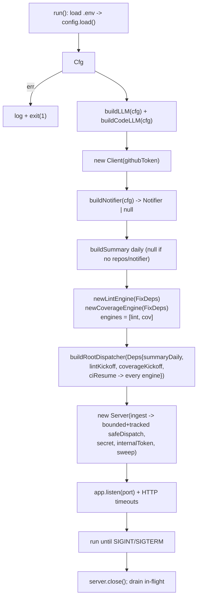

# cmd/agent

The service entrypoint. Responsibilities:

1. Load `config`.
2. Build the LLMs (`src/agent/setup`), tooling, and the root + summary agents plus the
   lint-fixer and coverage-fixer `fixflow` engines.
3. Start the webhook HTTP server (Express, with header/request/idle timeouts). Webhook
   dispatches run on a bounded pool (a permit is acquired before the 202) and every
   dispatch is tracked. The daily digest is driven by Cloud Scheduler calling
   `POST /internal/cron/daily`; the service runs no internal timer.
4. Run until interrupted, then close the server and drain in-flight dispatches (bounded by
   a 15s deadline) before exiting.

The fix loop suspends/resumes on ADK long-running tools backed by an injected `ParkStore`
(`SESSION_BACKEND`: memory | sqlite | firestore), with a per-run `CI_TIMEOUT` bounding each
wait. Cloud Scheduler also calls `POST /internal/sweep`, the durable timeout backstop that
reconciles parked runs whose soft timer was lost to a restart.

Keep this module thin — it is composition only. Anything testable belongs in `src/`.
