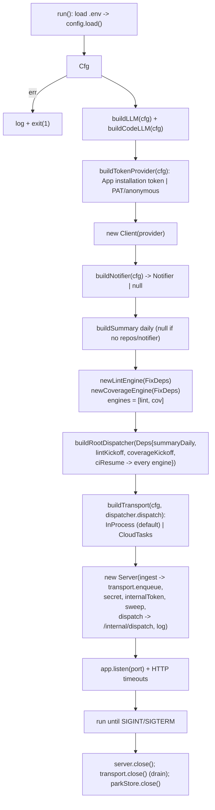

# cmd/agent

The service entrypoint. Responsibilities:

1. Load `config`.
2. Build the LLMs (`src/agent/setup`), tooling, and the root + summary agents plus the
   lint-fixer and coverage-fixer `fixflow` engines.
3. Start the webhook HTTP server (Express, with header/request/idle timeouts). Webhooks
   `enqueue` onto the execution transport (`buildTransport`): the **in-process** backend (the
   default, local dev) runs each dispatch on a bounded, drained pool; the **Cloud Tasks**
   backend (production, `TASKS_BACKEND=cloudtasks`) hands each envelope to the queue, which
   POSTs it to `/internal/dispatch` so the workflow runs **in-request** with durable retry —
   on Cloud Run's request-based billing, CPU is throttled after the 202, so long LLM compute
   must run inside a request. The same `dispatcher.dispatch` backs that worker endpoint. The
   daily digest is driven by Cloud Scheduler calling `POST /internal/cron/daily`; the service
   runs no internal timer.
4. Run until interrupted, then close the server, `transport.close()` to drain in-flight
   dispatches (the in-process backend; Cloud Tasks closes its client), and close the park
   store before exiting.

The fix loop suspends/resumes on ADK long-running tools backed by an injected `ParkStore`
(`SESSION_BACKEND`: memory | sqlite | firestore), with a per-run `CI_TIMEOUT` bounding each
wait. Cloud Scheduler also calls `POST /internal/sweep`, the durable timeout backstop that
reconciles parked runs whose soft timer was lost to a restart.

Keep this module thin — it is composition only. Anything testable belongs in `src/`.
