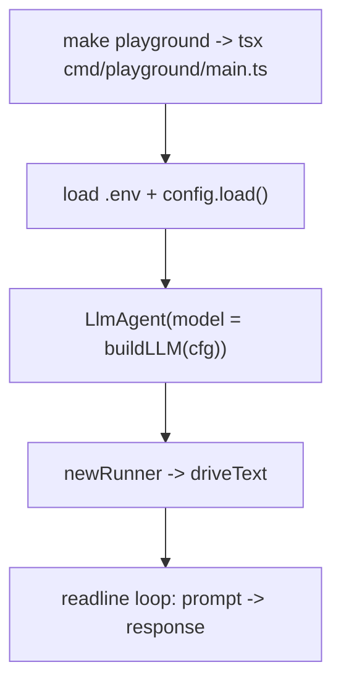

# cmd/playground

A local development REPL over the configured model. **Dev only — never deployed.**

Reads prompts from stdin and prints the model's reply, so you can poke the configured
model (Ollama/Gemma locally, or Gemini) without running the full service. Swap in the
summary / lintfixer / covfixer agents here to drive the real workflows interactively.

Composition only — no business logic. Nothing imports this module.
