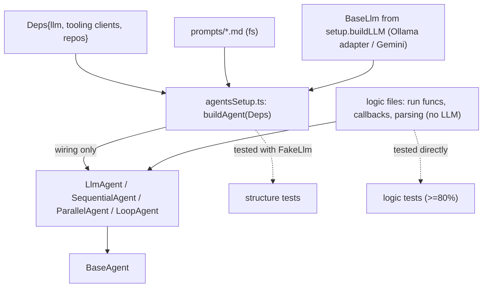

# src/agent

The agents. Each workflow agent gets its own directory (`root/`, `summary/`,
`lintfixer/`, `covfixer/`, `fixflow/`), and shared utilities live in `setup/`.

## The build-agent pattern (shared convention for every agent dir)

Each agent directory uses **one** `AGENTS.md` and splits wiring from logic:

- `agentsSetup.ts` — pure wiring: `build<Name>Agent(d: Deps): BaseAgent`, assembling
  ADK constructs from injected dependencies. No logic, no I/O.
- the logic file(s) — the testable behavior: code-agent run funcs, tool impls,
  callbacks, parsing.

Agents depend on the deterministic tooling in `src/...` and on `setup`; they never
import `cmd`.

## Models

Agents receive a `BaseLlm` from `setup.buildLLM` — they must not import a provider SDK
directly. Default local backend is Ollama + Gemma (via the `OllamaLlm` adapter); Gemini
is the cloud path. The switch is config-driven.

## Prompts

Each agent ships its own `prompts/*.md` and reads them via `setup.Prompts`. Prompts are
markdown, kept next to the agent.
