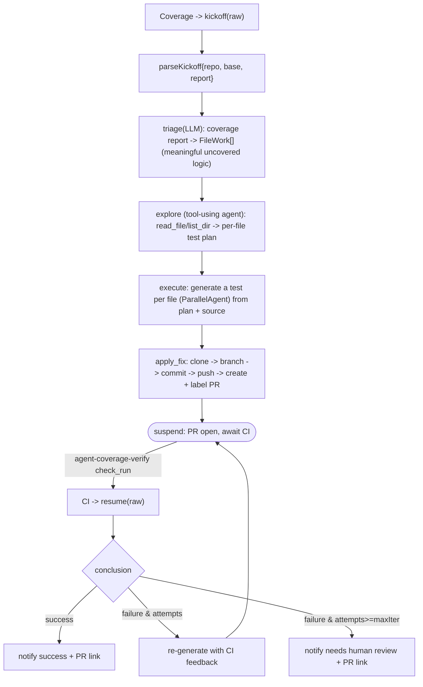

# src/agent/covfixer

The autonomous test-coverage workflow. Like the lint-fixer, it is a configuration of the
shared `fixflow` engine — its own triage/analyze functions and prompts on the same
deterministic kickoff -> suspend -> CI resume loop — but its analyze step is two-phase:
explore the repo's real test conventions, then generate a test per file.

## Files

- `coverage.ts` — `newCoverageEngine(Deps)`: the coverage `Spec` (branch/label/check +
  titles) that configures the shared `fixflow` engine.
- `triage.ts` — LLM coverage-report normalization (format-agnostic).
- `analyze.ts` — the two-phase explore (plan placement) + execute (write tests) step,
  with `PlanEntry` describing each file's test placement.
- `loader.ts` — prompt loading over this dir's `prompts/`.
- `prompts/{triage,explore,analyze,summarize_result}.md`.

The placement plan is grounded in the repo's actual existing tests (read via the explore
tools), never derived from a fixed rule. Tests use a scripted LLM routed by system
instruction (triage / explore-plan / execute) and assert on structure, never on
LLM-authored content. See `docs/architecture.md` §8.
