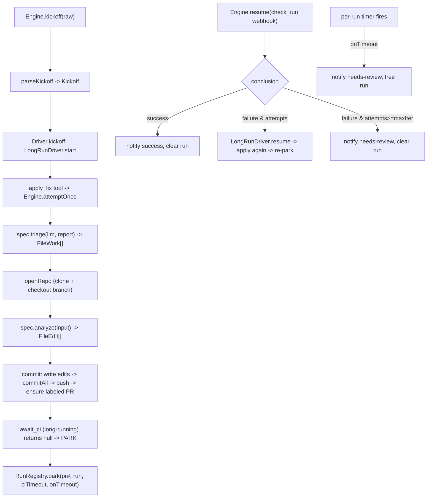

# src/agent/fixflow

The reusable, event-driven PR-fix engine shared by the lint-fixer and coverage-fixer.
A concrete agent supplies a `Spec` (triage + analyze functions, branch/label/check
names); the engine owns the loop, the apply mechanics, attempt counting, and the
in-memory parked-run registry.

- `envelope.ts` — `Kickoff` / `parseKickoff`: the trusted kickoff envelope a CI job posts.
- `engine.ts` — `Engine`, `Spec`, `Deps`, `newEngine`: the loop owner + attempt logic.
- `driver.ts` — `Driver`: the CI-wait suspend/resume loop on long-running tools; owns all
  retry/stop/timeout policy and the per-session `RunParams` (never model-controlled).
- `registry.ts` — `RunRegistry`: the in-memory parked-run record; `resolve` is the atomic
  single-winner claim shared by the CI webhook and the timeout timer.
- `applyfix.ts` — `openRepo` / `commit` / `applyFix`: clone, write edits (path-safe),
  commit, push, ensure a labeled PR.
- `analyze.ts` — `parallelAnalyze`: one analyzer agent per file, each writing distinct
  state keys, collecting non-empty edits.
- `explore.ts` — `explore`: a tool-using agent that reads the checkout to ground a plan.
- `tools.ts` / `files.ts` — read-only `read_file` / `list_dir` tools and the path-safe
  `safeJoin` that rejects absolute/escaping paths.
- `util.ts` — text-recovery helpers for model output (JSON extraction, fence stripping).

No durable store: parked runs live only in memory, so a process restart strands them
(an accepted trade-off). See `.agents/standards/architecture-design.md` §8.
