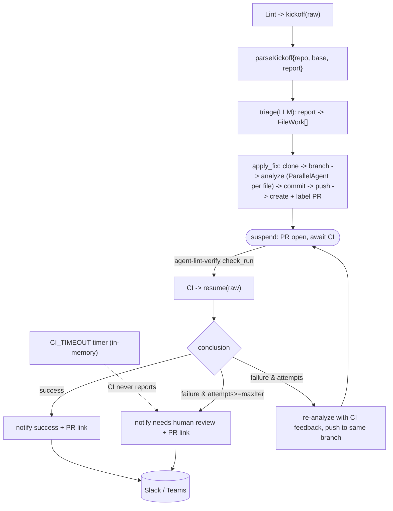

# src/agent/lintfixer

The autonomous lint-remediation workflow. It is a configuration of the shared `fixflow`
engine: its own triage/analyze functions and prompts, on `fixflow`'s deterministic
kickoff -> suspend -> CI resume -> loop or finish loop. The wait is a real long-running
suspend/resume because CI takes 20–40 min. The parked run is persisted through `fixflow`'s
injected `ParkStore` (indexed by `owner/repo#pr`), whose backend is selected by
`SESSION_BACKEND` — with sqlite/firestore it survives a restart, and `/internal/sweep`
reconciles a lost timer. A per-run `CI_TIMEOUT` timer bounds each wait.

## Files

- `lint.ts` — `newLintEngine(Deps)`: the lint `Spec` (branch/label/check + titles) that
  configures the shared `fixflow` engine.
- `triage.ts` — LLM report normalization (format-agnostic).
- `analyze.ts` — parallel per-file fix agents.
- `loader.ts` — prompt loading over this dir's `prompts/`.
- `prompts/{triage,analyze,summarize_result}.md`.

Wiring: `root` registers `Lint`/`CI`; `cmd` builds the engine (via `newLintEngine`) and
the webhook server. The kickoff/suspend/resume mechanics live in `fixflow`.
Provider SDKs are kept out via `setup` helpers. Tests use a scripted LLM + fakes + a local
seed repo. See `.agents/standards/architecture-design.md` §8.
