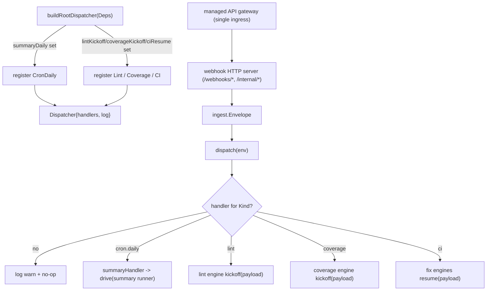

# src/agent/root

The dispatcher kicked off for every ingest. Build-agent pattern:

- `root.ts` — `Dispatcher`: routes an `ingest.Envelope` to a `Handler` by `Kind`.
  Unregistered kinds are logged and ignored (so a not-yet-wired ingress is a no-op).
- `agentsSetup.ts` — `buildRootDispatcher(Deps)` registers the available workflows: the
  `CronDaily` kind → the summary workflow runner (fired by the daily Cloud Scheduler
  trigger); `Lint`/`Coverage` → the fix engines' kickoff; `CI` → resume (handed to every
  fix engine, each a no-op unless its check matches).

Keeping a single entry point is the point of "root": new ingress sources and smarter
routing (e.g. LLM-based) slot in here without restructuring. Today it is a deterministic
dispatcher; it can become an ADK agent when LLM routing is wanted.

Tested directly (routing, unhandled no-op, error propagation) plus a build test that
drives a real runner with a trivial stub agent — no LLM needed.
