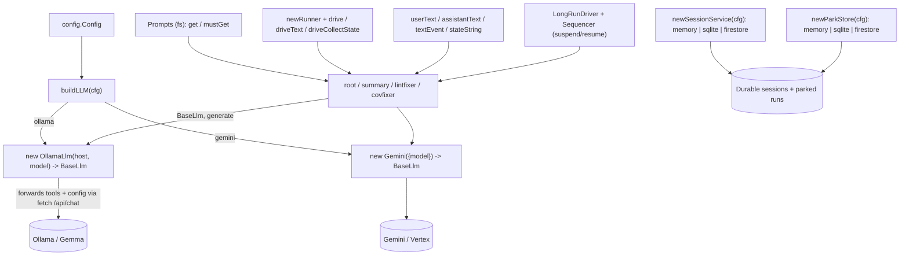

# src/agent/setup

Shared utilities for building agents. **This is the only module allowed to import
provider SDKs** (the Ollama adapter / Gemini / genai) — enforced by `arch/`.

- `llm.ts` — `buildLLM(cfg)` / `buildCodeLLM(cfg)`: the provider switch returning a
  `BaseLlm`. Provider selection lives entirely here.
- `ollama.ts` — `OllamaLlm extends BaseLlm`: the Ollama adapter. adk-js ships no Ollama
  model, so this forwards tool declarations + generation config to a local `/api/chat`
  endpoint over `fetch`.
- `gemini.ts` — `newGeminiModel(model)`: the cloud path via ADK's `Gemini`.
- `prompt`/`prompts.ts` — `Prompts`, a markdown loader (each agent ships its own
  `prompts/` dir, read from disk relative to `import.meta.url`).
- `events.ts` — small genai content helpers (`userText`, `contentText`, `lastText`,
  `textEvent`, `stateString`).
- `runner.ts` — in-memory runner helpers (`newRunner`, `drive`, `driveText`,
  `driveCollectState`).
- `longrun.ts` — generic ADK **long-running** suspend/resume plumbing: `LongRunDriver`
  (`start`/`resume` returning a plain `DriveResult`) and the `Sequencer` class, a
  deterministic Action->Wait `BaseLlm` for two-phase wait loops. Lives here because it
  touches `genai`; callers (e.g. `fixflow`) stay genai-free.
- `generate.ts` — `generateText`: one single-shot, non-streaming completion over the
  configured `BaseLlm` (system + user), for callers outside `setup` that must avoid genai.
- `names.ts` — `safeName`: maps a repo or file path to an ADK-agent-name-safe string
  (non-alphanumerics → `_`); shared by the path-derived sub-agent names.
- `session.ts` / `session_firestore.ts` — `newSessionService(cfg)`: the ADK session
  service for the configured backend (`InMemorySessionService` | `DatabaseSessionService`
  sqlite | `FirestoreSessionService`).
- `parkstore.ts` / `parkstore_sqlite.ts` / `parkstore_firestore.ts` — the `ParkStore`
  interface plus `newParkStore(cfg)` and its three backends (memory | sqlite | firestore):
  per-run suspend/resume state with single-winner claim semantics, the durable seam behind
  `fixflow`.

Tests stub the Ollama HTTP endpoint (`fetch`) and use a temp dir for prompts — no real
network, no live model. Never assert on LLM output content.
