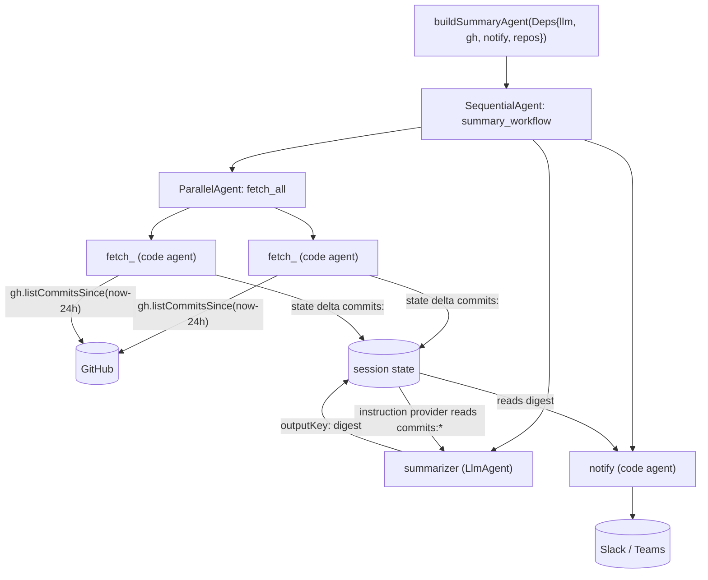

# src/agent/summary

The summary workflow agent. Build-agent pattern:

- `agentsSetup.ts` — `buildSummaryAgent(Deps)` wires
  `Sequential[ Parallel[fetch × N] -> summarize(LLM) -> notify ]`. Pure wiring.
- `summary.ts` — the testable logic: per-repo fetch code-agents, the notify code-agent,
  `formatCommits`, and the summarizer's instruction provider.
- `prompts/summarize.md` — the summarizer instruction (markdown, loaded from disk).

## Data flow

Each parallel fetcher writes its repo's commit digest to state under
`commits:<owner/repo>`. The summarizer's instruction provider reads all `commits:*`
keys, appends them to the prompt, and the model writes the digest to state under `digest`
(its `outputKey`). The notifier reads `digest` and posts it.

`CommitLister` is a consumer-defined interface over `githubapi` (fakeable). Tests cover
the deterministic helpers, structure, and end-to-end behavior through a real runner with
a fake model. Never assert on LLM output content.
