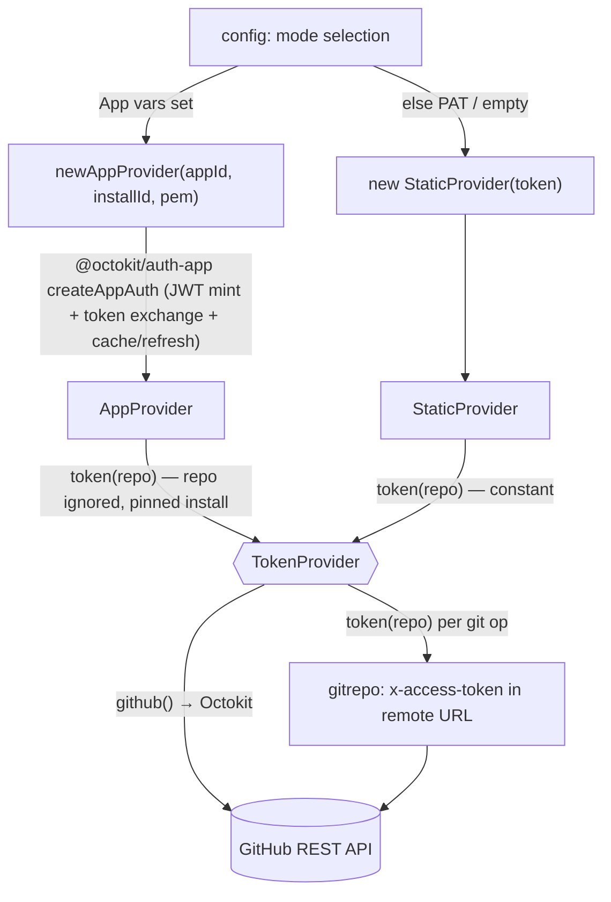

# src/auth

The GitHub authentication seam. One interface, `TokenProvider`, hides whether a token
comes from a static PAT (local-dev fallback) or a freshly minted GitHub App installation
token (production). See `specs/20260625-github-app-authentication.md`.

## Flow

- `TokenProvider.token(repo)` — the seam. `repo` is `"owner/name"`. PAT mode returns the
  same constant for every repo; App mode mints/caches a short-lived (~1h) installation
  token and refreshes it before expiry. It is **async** (App mode may mint over the
  network). The seam is the **cross-port contract** (`language-parity.md`); the library is
  per-port detail.
- `TokenProvider.github()` — a ready Octokit REST client. The githubapi `Client` consumes
  it directly, so REST and git share one provider (and, in App mode, one cached token).
- `StaticProvider` — constant token. Backs the PAT fallback and the empty (anonymous,
  public-read/test) client. An empty token is valid and yields an unauthenticated client.
- `AppProvider` — wraps `@octokit/auth-app`'s `createAppAuth` strategy on an Octokit pinned
  to **one** installation id (single-org per deployment — spec §1), so there is no
  per-owner cache and no dynamic `repo→installation` resolution. The `repo` argument is
  accepted for the contract but ignored. `token()` reads the installation token off the
  same Octokit auth hook the REST client uses (one cache, no double mint). `baseUrl`
  overrides the token-exchange endpoint for tests.

Mode selection and PEM/env handling live in `config` (not here): this module only consumes
an already-resolved app id / installation id / private-key PEM / PAT. The composition root
(`cmd/agent/main.ts`) picks the provider with `buildTokenProvider`. Deterministic tooling —
no agent imports. Tested with a throwaway RSA key + a localhost stub for the token exchange
(no live network, no LLM).
