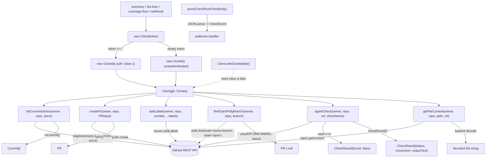

# src/githubapi

A thin wrapper over `@octokit/rest` exposing only what this service needs:

## Flow

- `listCommitsSince` — last-24h commit digests (summary workflow).
- `createPr` / `addLabels` — open and label the agent's fix PR.
- `findOpenPrByBranch` — the open PR for a head branch (used by `applyFix` to reuse an
  existing agent PR instead of opening a duplicate). Lookup is by branch, not label.
- `agentCheck` — the agent verify check's status/conclusion for a ref (`filter: latest`,
  re-run-safe). Available for a future resume/timeout re-query; not yet wired in.
- `getFileContent` — decoded file contents at a ref (`""` = default branch).

Each method returns its value or `throw`s an `Error`, and all I/O is `async` (every
method returns a `Promise`). Owner/repo are per-call so one client serves many repos.

Deterministic tooling — no agent imports. Tested by injecting an octokit-shaped
fake via `Client.withOctokit` (no live calls); the pure `parseCheckRunEvent` is
tested directly. Consumers define their own narrow interfaces over this client for
faking.
