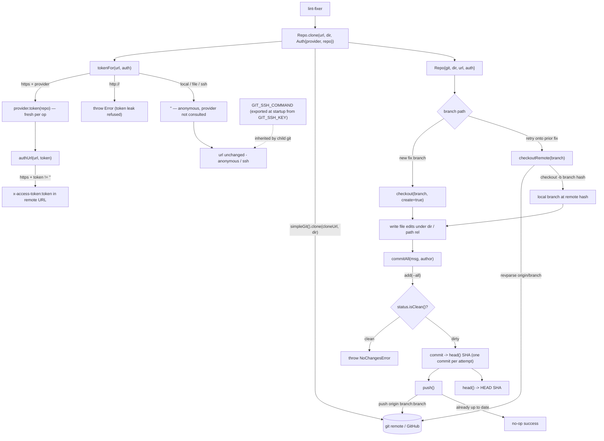

# src/gitrepo

Working-tree git operations via `simple-git`:

## Flow

- `clone(url, dir, Auth{provider, repo})` — auth is chosen by the URL scheme, not the
  caller. Because `simple-git` shells out to the system `git`, an `https` remote resolves a
  token from `provider.token(repo)` and embeds it as `x-access-token` HTTP auth (anonymous
  when the provider is null/absent or yields `""`), while a `git@…`/`ssh://…` remote passes
  through untouched and `git` uses ssh-agent, the default `~/.ssh` identity files, and
  `known_hosts` — exactly as the `ssh` binary resolves them. A plaintext `http://` remote is
  **refused** (`tokenFor` throws) — sending a token as basic auth over an unencrypted
  transport would leak it. The scheme is selected upstream by `GIT_TRANSPORT` (the engine
  builds the `git@github.com:…` URL). SSH covers the git transport only; the GitHub REST API
  still needs a token.
- `provider` is the `auth.TokenProvider` seam (a local interface here keeps gitrepo
  decoupled from `auth`). The token is re-fetched **per git op**: `push()` re-resolves it
  and re-points the origin URL, so a short-lived (~1h) GitHub App installation token minted
  at clone time stays current by push.
- The token is **stripped back out of `.git/config` before control returns** on the normal
  path: `clone` resets the origin URL to the clean (token-free) form immediately after
  cloning, and `push` re-tokenizes the URL only for the network call before restoring the
  clean URL in a `finally`. This keeps the credential from lingering in the working tree under
  normal operation. (If a reset itself fails, `clone` deletes the partial checkout and `push`
  surfaces the error rather than leaving a tokenized origin behind.) Unlike the Go reference —
  which supplies the token as transport auth and so never writes it to disk at all —
  `simple-git` shells out to the git CLI, which can't do transport auth, hence the set-url
  dance.
- `sshCommand(sshKey)` builds the `GIT_SSH_COMMAND` value (`ssh -i <key> -o IdentitiesOnly=yes`)
  that pins the ssh transport to an explicit `GIT_SSH_KEY`. The composition root
  (`cmd/agent/main.ts`) exports it into `process.env` once at startup so every child `git`
  inherits it with the full environment (PATH/HOME) intact. Doing it via `process.env` rather
  than simple-git's per-call `.env()` is deliberate: `.env()` *replaces* the child environment
  and would strip `PATH`, breaking git's lookup of the `ssh` binary; it also keeps `src/` free
  of `process.env` access (the "only config reads env" boundary).
- `checkout(branch, create)`, `commitAll(msg, author)` (stages all, returns SHA),
  `push()`, `head()`, `path(rel)`.

The lint-fixer writes file edits under `dir()`, then `commitAll` + `push` (one commit
per attempt). PR creation lives in `githubapi` (an API op, not a git op); attempt counts
live in the durable `ParkStore` record, not in GitHub.

Methods return a value or `throw`; committing a clean tree raises `NoChangesError`.
The committer identity is supplied inline (`-c user.name/user.email` plus `--author`)
so commits succeed without a globally configured git user. `head()` resolves the full
SHA via `revparse` because simple-git's `CommitResult.commit` is abbreviated.

Deterministic tooling — no agent imports. Tested against a local seed repo, so it
exercises real clone/branch/commit/push without network.
