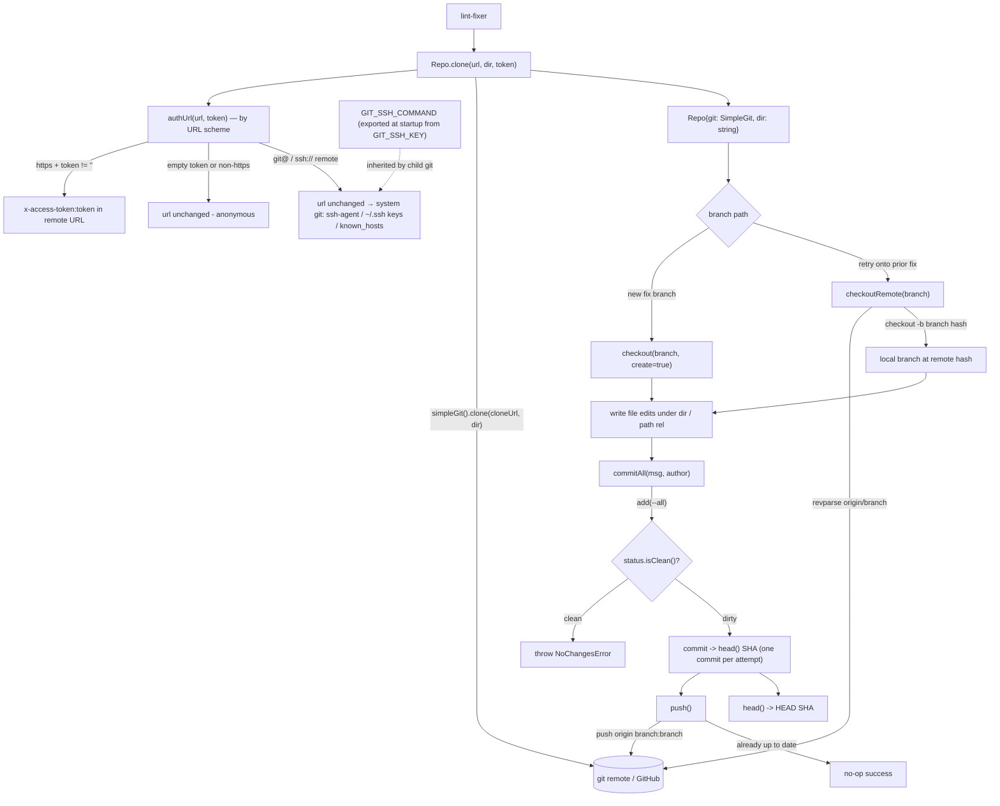

# src/gitrepo

Working-tree git operations via `simple-git`:

## Flow

- `clone(url, dir, token)` — auth is chosen by the URL scheme, not the caller. Because
  `simple-git` shells out to the system `git`, an `https` remote embeds the token as
  `x-access-token` HTTP auth (anonymous when empty), while a `git@…`/`ssh://…` remote passes
  through `authUrl` untouched and `git` uses ssh-agent, the default `~/.ssh` identity files,
  and `known_hosts` — exactly as the `ssh` binary resolves them. The scheme is selected
  upstream by `GIT_TRANSPORT` (the engine builds the `git@github.com:…` URL). SSH covers the
  git transport only; the GitHub REST API still needs a token.
- `sshCommand(sshKey)` builds the `GIT_SSH_COMMAND` value (`ssh -i <key> -o IdentitiesOnly=yes`)
  that pins the ssh transport to an explicit `GIT_SSH_KEY`. The composition root
  (`cmd/agent/main.ts`) exports it into `process.env` once at startup so every child `git`
  inherits it with the full environment (PATH/HOME) intact. Doing it via `process.env` rather
  than simple-git's per-call `.env()` is deliberate: `.env()` *replaces* the child environment
  and would strip `PATH`, breaking git's lookup of the `ssh` binary; it also keeps `src/` free
  of `process.env` access (the "only config reads env" boundary).
- `checkout(branch, create)`, `commitAll(msg, author)` (stages all, returns SHA),
  `push()`, `head()`, `path(rel)`.

The lint-fixer writes file edits under `dir()`, then `commitAll` + `push` (one commit
per attempt). PR creation lives in `githubapi` (an API op, not a git op); attempt counts
live in the durable `ParkStore` record, not in GitHub.

Methods return a value or `throw`; committing a clean tree raises `NoChangesError`.
The committer identity is supplied inline (`-c user.name/user.email` plus `--author`)
so commits succeed without a globally configured git user. `head()` resolves the full
SHA via `revparse` because simple-git's `CommitResult.commit` is abbreviated.

Deterministic tooling — no agent imports. Tested against a local seed repo, so it
exercises real clone/branch/commit/push without network.
