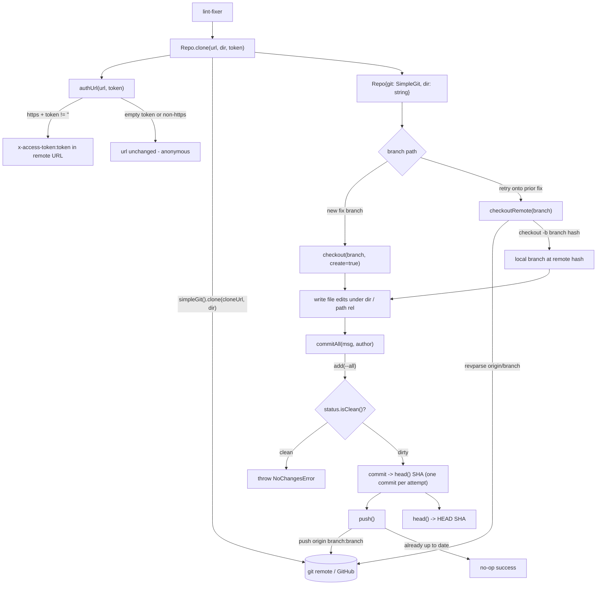

# src/gitrepo

Working-tree git operations via `simple-git`:

## Flow

- `clone(url, dir, token)` — token becomes GitHub `x-access-token` HTTP auth.
- `checkout(branch, create)`, `commitAll(msg, author)` (stages all, returns SHA),
  `push()`, `head()`, `path(rel)`.

The lint-fixer writes file edits under `dir()`, then `commitAll` + `push` (one commit
per attempt). PR creation lives in `githubapi` (an API op, not a git op); attempt counts
live in the in-memory parked-run registry, not in GitHub.

Methods return a value or `throw`; committing a clean tree raises `NoChangesError`.
The committer identity is supplied inline (`-c user.name/user.email` plus `--author`)
so commits succeed without a globally configured git user. `head()` resolves the full
SHA via `revparse` because simple-git's `CommitResult.commit` is abbreviated.

Deterministic tooling — no agent imports. Tested against a local seed repo, so it
exercises real clone/branch/commit/push without network.
