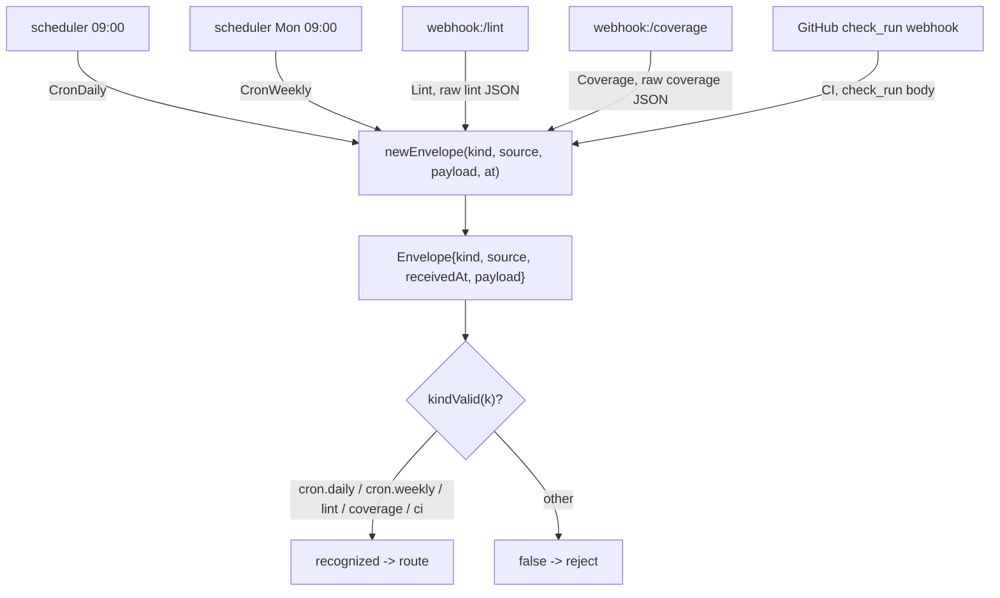

# src/ingest

The normalized `Envelope` that every ingress source is reduced to before reaching
the root agent. `Kind` identifies the trigger (cron.daily, cron.weekly, lint, coverage,
ci); `payload` carries the raw source body for the chosen workflow to parse.

- `envelope.ts` — `Envelope`, `Kind`, `kindValid()`, and `newEnvelope(...)`.

Adding a new ingress (e.g. Jira) means adding a `Kind` here and a handler that emits
an `Envelope` — the root agent's routing is the only other place that changes.
